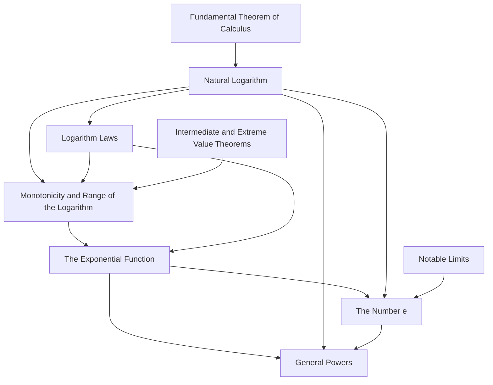

+++
title = "The Logarithm and Exponential Function"
slug = "logarithm"
toc = true
+++

This unit builds the natural logarithm, the exponential, the number $e$, and general powers in a single non-circular order, starting from the integral definition and never assuming a later object.

# Dependency Map



---

# The Natural Logarithm
## Definition

For $x > 0$,

$$ \ln x := \int_1^{x} \frac{1}{t}\thinspace dt. $$


### Type
The input $x$ is a positive real number, so $x \in (0, \infty )$. The output $\ln x$ is a single real number, so $\ln$ is a function $\ln : (0, \infty ) \to \mathbb{R}$. The letter $t$ is the variable of integration. It is a bound variable, which means it is internal to the integral, it ranges over the interval being integrated, and it never appears outside the integral. The input $x$ is a free variable, the upper limit of integration, and it is the one quantity the output depends on.


The symbol $\int $ is the integral, which here means the area between a curve and the horizontal axis. The lower limit $1$ is the fixed point where the accumulation of area starts. The upper limit $x$ is where the accumulation stops, and because the upper limit is the input, sliding $x$ is what produces different output values; this is why an area can be a function of one variable. The integrand $1/t$ is the height of the curve at each point $t$ along the way. The factor $dt$ marks $t$ as the variable being swept from the lower limit to the upper limit. **Put together, $\ln x$ is the running total of area under the curve $1/t$, measured from $1$ up to $x$.**

### Why-this-form

The integrand is $1/t$, and not some other expression, because the demand $L(xy) = L(x) + L(y)$, differentiated and evaluated at the input $1$, produced $L'(t) = C/t$. The choice $C = 1$ fixes the slope at the input $1$ to be $1$. So the definition is the antiderivative of $1/t$, an antiderivative being a function whose derivative is the given expression, pinned by the starting value that the integral supplies through its lower limit.

### Assumption

The lower limit is fixed at $1$, and the input must be positive. The reason for that comes down to a single point, $t = 0$. The integrand $1/t$ is undefined at $t = 0$, and worse, it grows without bound as $t$ approaches $0$ from either side, so the area near $t = 0$ is not finite. Any path of integration that touched or crossed $t = 0$ would pass through this singularity, which is a point where the integrand is not defined and the area is not finite. A path from $1$ to a positive $x$ never reaches $0$, so it stays in the region where $1/t$ is well behaved. A path from $1$ to a negative number would have to cross $0$, so it is not allowed. This is why the domain is the open interval $(0, \infty )$, and not merely the set of nonzero reals. The single bad point at $0$ removes the entire negative side, because there is no way to reach it from $1$ without crossing the singularity.
## Algebra
Two facts follow directly from the definition, and each is derived rather than asserted.

The first is the value at $1$.

<div class="math-block">
\begin{equation}
\ln 1 = \int_1^{1} \frac{1}{t}\thinspace dt = 0. \tag{1}
\end{equation}
</div>


Equation $(1)$ holds because the lower and upper limits are equal. The interval from $1$ to $1$ has no width, so there is no area to accumulate, and the integral of any function over an interval of zero width is $0$.

This is the definition of the integral over an empty interval.

The second is the derivative.


<div class="math-block">
\begin{equation}
\ln^{\prime}(x) = \frac{1}{x} \quad \text{for every } x > 0. \tag{2}
\end{equation}
</div>


Equation $(2)$ is the first part of the Fundamental Theorem of Calculus applied to this integral. That theorem says that when you integrate a continuous function from a fixed lower limit up to a variable upper limit, the derivative of the resulting area, taken with respect to the upper limit, is the integrand evaluated at the upper limit. The integrand here is $1/t$, and the upper limit is $x$, so the derivative is $1/t$ with $t$ replaced by $x$, which is $1/x$. The theorem applies because $1/t$ is continuous on the whole path from $1$ to $x$, which holds precisely because that path avoids the singularity at $0$.

The definition also produces signed values, and the sign is part of the object, not an afterthought. When $x > 1$, the upper limit lies to the right of the lower limit, the area is swept in the positive direction, and $\ln x$ is positive. When $0 < x < 1$, the upper limit lies to the left of the lower limit, so the sweep runs in the negative direction. A definite integral whose upper limit is below its lower limit is the negative of the integral taken the other way, written $\int_1^{x} = -\int_{x}^{1}$. The area under $1/t$ from $x$ to $1$ is a genuine positive area, so $\ln x$ is its negative, a negative number. At the boundary $x = 1$ the two limits coincide and the value is $0$, from equation $(1)$. So $\ln$ is negative on $(0, 1)$, zero at $1$, and positive on $(1, \infty)$.

## Properties (Consequences of the Definition)



- $\ln 1 = 0$, from equation $(1)$, because the interval has zero width.
- $\ln^{\prime}(x) = 1/x$ for $x > 0$, from equation $(2)$, by the Fundamental Theorem of Calculus part one.
- $\ln x < 0$ for $0 < x < 1$, $\ln 1 = 0$, and $\ln x > 0$ for $x > 1$, from the sign of the swept area.


## Visualizing the Concept

$\ln x$ is the signed area under the curve $1/t$ between $1$ and $x$. For $x > 1$ the region lies to the right of $1$ and the area is positive. For $0 < x < 1$ the upper limit sits to the left of $1$, the sweep direction reverses, and the area counts as negative. At $x = 1$ there is no region and the value is $0$. The curve $1/t$ falls steeply toward the vertical axis on the left, which is the singularity at $0$ that the domain restriction avoids.

<svg viewBox="0 0 520 300" xmlns="http://www.w3.org/2000/svg" font-family="sans-serif" fill="currentColor">
  <text x="260" y="22" text-anchor="middle" font-size="14.5" font-weight="600">ln x is the signed area under 1/t from 1 to x</text>
  <line x1="60" y1="250" x2="490" y2="250" stroke="currentColor" stroke-width="1.1" opacity="0.6"/>
  <line x1="60" y1="60" x2="60" y2="258" stroke="currentColor" stroke-width="1.1" opacity="0.6"/>
  <path d="M70 95 Q140 175 220 205 Q320 232 470 243" fill="none" stroke="#2c7be5" stroke-width="2.4"/>
  <path d="M150 250 L150 222 Q200 210 220 205 Q300 233 360 240 L360 250 Z" fill="#2c7be5" opacity="0.16"/>
  <line x1="150" y1="250" x2="150" y2="222" stroke="currentColor" stroke-width="1" opacity="0.4"/>
  <line x1="360" y1="250" x2="360" y2="240" stroke="currentColor" stroke-width="1" opacity="0.4"/>
  <text x="150" y="266" text-anchor="middle" font-size="12" opacity="0.8">1</text>
  <text x="360" y="266" text-anchor="middle" font-size="12" opacity="0.8">x</text>
  <text x="255" y="240" text-anchor="middle" font-size="11" opacity="0.75">area = ln x</text>
  <text x="80" y="90" font-size="11" fill="#2c7be5">y = 1/t</text>
</svg>

### Alternative Viewpoints & Core Concepts


**POV**:

The natural logarithm can also be read as the function whose rate of change is $1/x$ and whose value at $1$ is $0$. This is the differential-equation viewpoint. It says $\ln$ is the unique solution of the equation $y'(x) = 1/x$ with the side condition $y(1) = 0$. The two viewpoints describe one function: the area viewpoint builds it by accumulation, and the differential-equation viewpoint pins it by its slope plus one known value. They agree because equation $(2)$ gives the slope and equation $(1)$ gives the known value. Deriving one from the other is exactly the Fundamental Theorem of Calculus, which connects accumulation to slope.


**Cross-domain**:

The same function appears as a measure of information. In information theory the information content of an event of probability $p$ is $-\ln p$, measured in units called nats. The reason information adds for independent events is the same multiplication-to-addition property that defines $\ln$: independent probabilities multiply, and their information adds.


**Process⇄Object**:


At first the integral $\int_1^x (1/t)\thinspace dt$ reads as a process: area piling up as the upper limit slides from $1$ toward $x$. Once we name that accumulation $\ln x$ and start treating it as a function with its own graph, its own derivative $\ln^{\prime}$, and later its own inverse, it has quietly turned into an object. That shift, from a process you carry out to an object you operate on, is what we call reification, and it is exactly what makes statements like $\ln^{\prime}(x) = 1/x$ and "the inverse of $\ln$" mean anything at all.


**Variable-role**:

Inside the integral, $t$ is a bound variable. Its name has no effect on the value; rename every $t$ to $s$ and nothing changes. It lives only between the integral sign and the $dt$. The input $x$, by contrast, is a free variable, the upper limit, and it is what the output actually tracks. Writing $1/x$ inside the integral in place of $1/t$ would be a type error, since it swaps the swept variable for the fixed input.

## Proofs & Implementation

To compute $\ln x$ by hand, compute the area under $1/t$ from $1$ to $x$. The curve $1/t$ is positive and decreasing for $t > 0$, and this shape gives simple bounds. Split the interval $[1, x]$ into $n$ equal pieces, each of width $h = (x - 1)/n$. On each piece the curve is highest at the left end and lowest at the right end, because the curve decreases. The rectangle that uses the left-end height overestimates the area of that piece, and the rectangle that uses the right-end height underestimates it. Summing across all pieces, the sum of left-end rectangles is larger than $\ln x$ and the sum of right-end rectangles is smaller, so the true value is trapped between them. Increasing $n$ narrows the trap. The trapezoidal rule, which averages the two end heights on each piece, sits between the two sums and converges faster than either.

We implement the area directly with the trapezoidal rule, written against the Python array API so the same code runs on any conforming array library. We do not call any library logarithm, because the logarithm is the object being built, and calling a finished logarithm would hide the construction.

```python
import numpy as np  # an array-API-conforming namespace

xp = np  # use the array-API surface through xp


def ln_area(x, n=200_000):
    """Return the natural logarithm of x as an area under 1/t.

    Computes the integral of 1/t from 1 to x with the trapezoidal rule.
    The logarithm is built from the area, so no library logarithm is called.

    Parameters
    ----------
    x : float
        The input, required to be positive.
    n : int, optional
        The number of grid intervals. More intervals reduce the
        discretization error but add rounding from more summed terms.

    Returns
    -------
    float
        The approximate value of ln(x). For 0 < x < 1 the grid runs
        downward and the returned area is negative, which is correct.
    """
    t = xp.linspace(1.0, x, n + 1)  # grid of n + 1 points, shape (n + 1,)
    f = 1.0 / t  # integrand at each grid point, shape (n + 1,)
    h = (x - 1.0) / n  # signed width of one interval
    # Trapezoidal rule: h times (sum of all points minus half each endpoint).
    return h * (xp.sum(f) - 0.5 * (f[0] + f[-1]))
```

**Discretization**:

We swap the continuous area for a finite grid of $n$ pieces, and that swap costs something. The grid spacing $h$ is its own source of error, separate from rounding. With too few pieces, the trapezoidal estimate is visibly off.

**Truncation**:

The trapezoidal rule's error shrinks like $h^2$, but $h$ is never actually zero, so some residual error always survives. Getting the area exactly right would take infinitely many pieces, and we always stop at a finite $n$.

**Step-size**:

Raising $n$ shrinks both the discretization and truncation error, but it also piles on more terms, and each new term brings its own rounding. Past a certain point, adding pieces stops helping and starts hurting, so there is a sweet spot for $n$ somewhere in the middle.

**Error-accumulation**:

The sum runs over $n$ terms, and each term's tiny rounding error adds to the pile. For very large $n$ a naive sum drifts off. Compensated summation reins this in, at the cost of more work.

**Conditioning**:

As $x$ approaches $0$, the integrand $1/t$ blows up near the left end of the path, so the area gets genuinely hard to pin down. The problem itself amplifies error there, before you've even picked a method.

---

# Logarithm Laws

## Theorems


### Product Law
For $a, b > 0$,


$$ \ln(ab) = \ln a + \ln b. $$



### Quotient Law
For $a, b > 0$,
$$ \ln\!\left(\frac{a}{b}\right) = \ln a - \ln b. $$



### Power Law (Rational Exponent)
For $a > 0$ and a rational number $r$,
$$ \ln(a^{r}) = r \ln a. $$


### Type

In every law the inputs $a$ and $b$ are positive reals, and the outputs are reals. For now the exponent $r$ in the power law is rational. We push the power law out to an arbitrary real exponent later, in [General Powers](#general-powers), because a real power $a^r$ has to be defined first, and that definition leans on the exponential function.

### Assumption

Each input to a logarithm has to be positive on its own. The product law needs $a > 0$ and $b > 0$ separately, not just $ab > 0$. Here is why: the symbols $\ln a$ and $\ln b$ on the right-hand side each have to mean something, and the logarithm only accepts positive inputs. Two negatives multiply to a positive, so $ab$ could be positive while $a$ and $b$ are both negative, and then the right-hand side is nonsense.

### Why-this-form

The laws read the way they do because the logarithm trades the multiplicative structure of the positive reals for the additive structure of all the reals. Multiplication turns into addition, division into subtraction, and a power into a product with the exponent. The quotient and power laws are not separate inventions; they fall straight out of the product law, as the proofs below show.

### Property: Reciprocal Value


For $a > 0$, $\ln(1/a) = -\ln a$. This is the quotient law with $a = 1$ in the numerator, using $\ln 1 = 0$. Recall: $\ln 1 = 0$ because the integral over the zero-width interval from $1$ to $1$ is $0$.


## Visualizing the Concept

### Visualizing the Product Law

The product law is area additivity in disguise. The area under $1/t$ from $1$ to $ab$ can be cut at the point $a$ into two pieces: the area from $1$ to $a$, which is $\ln a$, and the area from $a$ to $ab$, which turns out to equal $\ln b$. The second piece equals $\ln b$ because stretching the interval $[1, b]$ by the factor $a$ carries it to $[a, ab]$, and the curve $1/t$ shrinks by exactly the same factor under that stretch, so the area is unchanged.

<svg viewBox="0 0 520 290" xmlns="http://www.w3.org/2000/svg" font-family="sans-serif" fill="currentColor">
  <text x="260" y="22" text-anchor="middle" font-size="14" font-weight="600">area(1 to ab) = area(1 to a) + area(a to ab)</text>
  <line x1="50" y1="240" x2="500" y2="240" stroke="currentColor" stroke-width="1.1" opacity="0.6"/>
  <line x1="50" y1="60" x2="50" y2="248" stroke="currentColor" stroke-width="1.1" opacity="0.6"/>
  <path d="M60 95 Q150 180 250 210 Q360 233 490 240" fill="none" stroke="#2c7be5" stroke-width="2.3"/>
  <path d="M110 240 L110 205 Q160 192 210 188 L210 240 Z" fill="#2c7be5" opacity="0.18"/>
  <path d="M210 240 L210 188 Q300 210 400 232 L400 240 Z" fill="#1a9e6e" opacity="0.16"/>
  <line x1="110" y1="240" x2="110" y2="205" stroke="currentColor" stroke-width="1" opacity="0.4"/>
  <line x1="210" y1="240" x2="210" y2="188" stroke="currentColor" stroke-width="1" opacity="0.4"/>
  <line x1="400" y1="240" x2="400" y2="232" stroke="currentColor" stroke-width="1" opacity="0.4"/>
  <text x="110" y="256" text-anchor="middle" font-size="12" opacity="0.8">1</text>
  <text x="210" y="256" text-anchor="middle" font-size="12" opacity="0.8">a</text>
  <text x="400" y="256" text-anchor="middle" font-size="12" opacity="0.8">ab</text>
  <text x="160" y="228" text-anchor="middle" font-size="10" opacity="0.8">ln a</text>
  <text x="305" y="232" text-anchor="middle" font-size="10" opacity="0.8">ln b</text>
</svg>

### Alternative Viewpoints & Core Concepts

**POV**:

Taken together, the three laws say the logarithm is a structure-preserving map between two number systems. The positive reals under multiplication form a group, meaning a set with an operation that has an identity and inverses. The reals under addition form another group. The logarithm sends the first to the second, turning multiplication into addition, division into subtraction, and the multiplicative identity $1$ into the additive identity $0$. A map that preserves the operation like this is called a group homomorphism.

**Cross-domain**:

This trade is why logarithmic scales are everywhere. The decibel scale for sound, the pH scale for acidity, and the Richter scale for earthquakes all run a logarithm so that multiplying a physical quantity by a fixed factor becomes adding a fixed amount on the scale. In statistics and machine learning the log-likelihood swaps a product of many probabilities for a sum, using the product law, and that sum is far more stable to compute.

**Isomorphism**:

The logarithm is not just any homomorphism. On the positive reals it is a bijection onto all the reals, proved in [Monotonicity and Range](#monotonicity-and-range), which makes it an isomorphism between the multiplicative positive reals and the additive reals. The two systems are then "the same" in a precise sense: a dictionary translates every multiplicative statement into an additive one with nothing lost. The silent shift is reading $\ln$ not as a numerical function but as this dictionary between two structures.

**Arbitrary-object**:

The product-law proof pins one value $a$ down as a constant and lets the other input vary. That single fixed $a$ stands in for every positive number, because the argument never used anything special about it. Noticing that one concrete choice settles the statement for all choices is the move that turns a single calculation into a universal law.

## Proofs & Implementation

### Proofs of the Laws

#### Proof of the product law

Fix a positive number $a$, and define a helper function on the positive reals:

<div class="math-block">
\begin{equation}
g(x) := \ln(ax). \tag{3}
\end{equation}
</div>


Differentiate $g$ using the chain rule. The outer function is $\ln$, whose derivative is $1/(\cdot)$, and the inner function is $ax$, whose derivative with respect to $x$ is $a$:


<div class="math-block">
\begin{equation}
g^{\prime}(x) = \frac{1}{ax}\cdot a = \frac{1}{x}. \tag{4}
\end{equation}
</div>


Equation $(4)$ shows $g'(x) = 1/x$, which is exactly $\ln^{\prime}(x)$. Recall $\ln^{\prime}(x) = 1/x$ from the Fundamental Theorem of Calculus. So $g$ and $\ln$ have the same derivative on the whole interval of positive numbers. Since two functions with equal derivatives on an interval differ by a constant (a consequence of the Mean Value Theorem):


<div class="math-block">
\begin{equation}
g(x) = \ln x + C \tag{5}
\end{equation}
</div>


for some constant $C$. To find $C$, evaluate equation $(5)$ at $x = 1$. The left side is $g(1) = \ln(a\cdot 1) = \ln a$, and the right side is $\ln 1 + C = 0 + C$, using $\ln 1 = 0$. So $C = \ln a$. Putting $C$ back into equation $(5)$:


<div class="math-block">
\begin{equation}
\ln(ax) = \ln x + \ln a \quad \text{for all } x > 0. \tag{6}
\end{equation}
</div>


Equation $(6)$ holds for every $x$. Set $x = b$ to get $\ln(ab) = \ln a + \ln b$. Since $a$ was fixed but arbitrary, the identity holds for every positive $a$ and $b$. $\blacksquare$

#### Proof of the quotient law

Start from the product law applied to $b$ and $a/b$, both positive:


<div class="math-block">
\begin{equation}
\ln\!\left(b \cdot \frac{a}{b}\right) = \ln b + \ln\!\left(\frac{a}{b}\right). \tag{7}
\end{equation}
</div>


The left side simplifies, since $b\cdot (a/b) = a$, to $\ln a$. Rearranging equation $(7)$ gives $\ln(a/b) = \ln a - \ln b$. The reciprocal value $\ln(1/a) = -\ln a$ is the case $a = 1$ in the numerator. $\blacksquare$

#### Proof of the power law for rational exponents

First take a positive integer $n$. Apply the product law $n$ times to the product of $n$ copies of $a$:


<div class="math-block">
\begin{equation}
\ln(a^{n}) = \ln(\underbrace{a \cdot a \cdots a}_{n}) = \underbrace{\ln a + \dots + \ln a}_{n} = n \ln a. \tag{8}
\end{equation}
</div>


Equation $(8)$ is the integer case, proved by repeated use of the product law, which is a short induction on $n$. For a negative integer $-n$, the reciprocal value gives $\ln(a^{-n}) = \ln(1/a^{n}) = -\ln(a^{n}) = -n\ln a$. For a rational exponent $r = p/q$ with integer $p$ and positive integer $q$, set $c = a^{p/q}$, so $c^{q} = a^{p}$. Apply the integer law to both sides: $\ln(c^{q}) = q\ln c$ and $\ln(a^{p}) = p\ln a$, and since $c^{q} = a^{p}$ the left sides are equal, giving $q\ln c = p\ln a$, hence $\ln c = (p/q)\ln a = r\ln a$. $\blacksquare$

---

# Monotonicity and Range

## Theorems


### Strict Monotonicity
The function $\ln$ is strictly increasing on $(0, \infty)$: if $0 < x_1 < x_2$, then $\ln x_1 < \ln x_2$. Consequently $\ln$ is one-to-one.



### Range is all of the Reals
The function $\ln$ is unbounded above and unbounded below, and it is continuous, so its range is all of $\mathbb{R}$: every real number is $\ln x$ for exactly one $x > 0$.



### Bijection
The function $\ln : (0, \infty) \to \mathbb{R}$ is a bijection, meaning it is both one-to-one and onto. Therefore it has an inverse function defined on all of $\mathbb{R}$.


### Type

The domain is the positive reals $(0, \infty)$ and the codomain is all of $\mathbb{R}$. One-to-one, also called injective, means different inputs always give different outputs. Onto, also called surjective, means every value in the codomain actually gets hit. A bijection is both at once, and only a bijection has a two-sided inverse.

### Assumption

Strict monotonicity rests on the derivative $1/x$ being strictly positive for every $x > 0$. This is where the restriction to positive inputs earns its keep again: on the positive reals the derivative never vanishes and never flips sign, so the function climbs uniformly across the whole domain.

### Why-this-form

The two properties are exactly the two halves of invertibility. Strict increase gives the one-to-one half, since a function that keeps climbing can never revisit a value it has already passed. The full range gives the onto half, since the inverse needs every real number to be a genuine output before it can accept it as an input. Keeping them separate keeps each half of the proof clean, and the bijection theorem then bolts them together.

## Visualizing the Concept

### Visualizing Monotonicity

The graph of $\ln$ rises without ever levelling off or turning back. It crosses the height $0$ at the input $1$. As the input moves right toward infinity the graph rises past every horizontal line, and as the input moves left toward $0$ the graph falls past every horizontal line. Because the graph is continuous and rises through every height exactly once, each horizontal line meets it at exactly one point, which is the geometric form of the bijection.

<svg viewBox="0 0 520 300" xmlns="http://www.w3.org/2000/svg" font-family="sans-serif" fill="currentColor">
  <text x="260" y="22" text-anchor="middle" font-size="14" font-weight="600">ln rises through every height exactly once</text>
  <line x1="60" y1="160" x2="500" y2="160" stroke="currentColor" stroke-width="1" opacity="0.45"/>
  <line x1="120" y1="50" x2="120" y2="270" stroke="currentColor" stroke-width="1" opacity="0.45"/>
  <path d="M124 268 Q140 200 200 168 Q300 128 490 95" fill="none" stroke="#2c7be5" stroke-width="2.5"/>
  <circle cx="200" cy="160" r="4" fill="#2c7be5"/>
  <text x="200" y="178" text-anchor="middle" font-size="11" opacity="0.8">(1, 0)</text>
  <line x1="60" y1="120" x2="430" y2="120" stroke="#1a9e6e" stroke-width="1" stroke-dasharray="5 4" opacity="0.8"/>
  <text x="64" y="114" font-size="10" fill="#1a9e6e">any height y</text>
  <circle cx="345" cy="120" r="3.5" fill="#1a9e6e"/>
  <text x="345" y="138" text-anchor="middle" font-size="10" opacity="0.8">one input</text>
</svg>

### Alternative Viewpoints & Core Concepts

**POV**:

Strict monotonicity can be read as an order-preserving property. The logarithm doesn't just send multiplication to addition; it also carries the order on the positive reals over to the order on all reals: $x_1 < x_2$ exactly when $\ln x_1 < \ln x_2$. Put together with the [Logarithm Laws](#logarithm-laws), this makes the logarithm an order isomorphism between the ordered multiplicative positive reals and the ordered additive reals. It preserves the operation and the order in one stroke.

**Cross-domain**:

This order-preserving bijection is why logarithmic axes work in science and data display. A log axis maps the positive measurements onto the whole line without scrambling their order, so very small and very large quantities both fit on one chart, their order survives, and equal ratios show up as equal spacings.

**Limit-object**:

The phrases "unbounded above" and "unbounded below" are about values that are approached but never reached. The logarithm has no largest or smallest value; it climbs past every height and sinks below every height. Reading $\ln x \to +\infty$ and $\ln x \to -\infty$ as limits that are approached but never attained is the right way to think about it, and it is what makes the range an open-ended whole line rather than a bounded interval.

**Isomorphism**:

Once the map is a bijection that preserves both operation and order, the two number systems are "the same" in a precise sense. Every true statement about multiplying and comparing positive reals translates into a true statement about adding and comparing all reals. The silent shift is treating $\ln$ as this translation between two structures, not merely as a numerical function.

## Proofs & Implementation

### Proofs of Monotonicity & Range

#### Proof of strict monotonicity

Take $0 < x_1 < x_2$. The logarithm is differentiable on $[x_1, x_2]$, so the Mean Value Theorem gives a point $c$ with $x_1 < c < x_2$ such that


<div class="math-block">
\begin{equation}
\ln x_2 - \ln x_1 = \ln^{\prime}(c)\thinspace (x_2 - x_1) = \frac{1}{c}\thinspace (x_2 - x_1). \tag{9}
\end{equation}
</div>


In equation $(9)$ the factor $1/c$ is positive because $c > 0$, and the factor $x_2 - x_1$ is positive because $x_1 < x_2$. A product of two positive numbers is positive, so $\ln x_2 - \ln x_1 > 0$, which means $\ln x_1 < \ln x_2$. One-to-one follows at once: if $x_1 \ne x_2$ then one is smaller, so their logarithms differ, and no two distinct inputs can share an output. $\blacksquare$

#### Proof that the range is all of the reals

First show unbounded above. Recall from the [Logarithm Laws](#logarithm-laws) that $\ln(2^{n}) = n\ln 2$, and $\ln 2 > 0$ because $2 > 1$ and the logarithm is positive on $(1, \infty)$. So as the integer $n$ grows, $n\ln 2$ grows past every bound:


<div class="math-block">
\begin{equation}
\ln(2^{n}) = n \ln 2 \to +\infty. \tag{10}
\end{equation}
</div>


Equation $(10)$ shows that for any target height $M$, some input $2^{n}$ has a logarithm above $M$. Next show unbounded below. The reciprocal value gives $\ln(2^{-n}) = -n\ln 2$, which falls past every bound:


<div class="math-block">
\begin{equation}
\ln(2^{-n}) = -n\ln 2 \to -\infty. \tag{11}
\end{equation}
</div>


Now fill the values between. The logarithm is differentiable, hence continuous. Take any real target $y$. By equation $(10)$ there is an input $b$ with $\ln b > y$, and by equation $(11)$ there is an input $a$ with $\ln a < y$. The logarithm is continuous on $[a, b]$, and $y$ lies between $\ln a$ and $\ln b$, so the Intermediate Value Theorem gives a point $x$ in $[a, b]$ with $\ln x = y$. So every real $y$ is attained, and the range is all of $\mathbb{R}$. $\blacksquare$

#### Proof of the bijection

The logarithm is one-to-one from strict monotonicity and onto $\mathbb{R}$ from the range theorem. A function that is both one-to-one and onto is a bijection, and a bijection has a two-sided inverse defined on its codomain. So $\ln : (0,\infty) \to \mathbb{R}$ has an inverse defined on all of $\mathbb{R}$, which is the function built in [The Exponential Function](#the-exponential-function). $\blacksquare$

---

# The Exponential Function

## Definition


The exponential function $\exp : \mathbb{R} \to (0, \infty)$ is the inverse of the natural logarithm. For every real $x$,


$$ \exp(x) = y \quad \text{means exactly} \quad \ln(y) = x. $$


### Type

The input $x$ is any real number, so the domain is all of $\mathbb{R}$. The output $\exp(x)$ is a positive real, so the codomain is $(0, \infty)$. This is the logarithm run backwards: there the domain was $(0, \infty)$ and the codomain was $\mathbb{R}$.

### Assumption

The definition is well posed only because $\ln$ is a bijection. One-to-one guarantees the inverse hands back a single output for each input, and onto guarantees it accepts every real input. Without both halves, the inverse would be either ambiguous or undefined somewhere.

The inverse relationship is two equations, and both directions matter.

<div class="math-block">
\begin{equation}
\ln(\exp(x)) = x \ \text{ for all } x \in \mathbb{R}, \qquad \exp(\ln(y)) = y \ \text{ for all } y > 0. \tag{12}
\end{equation}
</div>


Equation $(12)$ says the two functions undo each other. Applying the logarithm after the exponential returns the original real input, and applying the exponential after the logarithm returns the original positive input. These are the defining identities of any inverse pair.

### Why-this-form

Reading the exponential as "the inverse of $\ln$" rather than as "a base raised to a power" is what keeps the whole construction non-circular. The base-and-power reading comes back in [General Powers](#general-powers), where a real power is finally defined using this exponential. The order is fixed: logarithm first, exponential as its inverse second, general powers third.

### Property: Immediate Consequences


- $\exp(0) = 1$, because $\ln 1 = 0$, so the inverse sends $0$ back to $1$.
- $\exp^{\prime}(x) = \exp(x)$: the exponential is its own derivative.
- $\exp(x + y) = \exp(x)\thinspace \exp(y)$: the exponential turns addition into multiplication.


## Visualizing the Concept

### Visualizing the Exponential

The graph of $\exp$ is the graph of $\ln$ reflected across the line $y = x$. Reflecting across $y = x$ is the geometric form of swapping input and output, which is what taking an inverse does. The logarithm passes through $(1, 0)$, so the exponential passes through $(0, 1)$. The logarithm rose slowly and was defined only for positive inputs; the exponential rises quickly and stays positive for every input.

<svg viewBox="0 0 320 300" xmlns="http://www.w3.org/2000/svg" font-family="sans-serif" fill="currentColor">
  <text x="160" y="20" text-anchor="middle" font-size="13.5" font-weight="600">exp is ln reflected across y = x</text>
  <line x1="40" y1="260" x2="300" y2="260" stroke="currentColor" stroke-width="1" opacity="0.45"/>
  <line x1="40" y1="40" x2="40" y2="270" stroke="currentColor" stroke-width="1" opacity="0.45"/>
  <line x1="40" y1="260" x2="280" y2="40" stroke="currentColor" stroke-width="1" opacity="0.3" stroke-dasharray="4 4"/>
  <text x="270" y="52" font-size="10" opacity="0.6">y = x</text>
  <path d="M70 250 Q130 200 280 80" fill="none" stroke="#2c7be5" stroke-width="2.3"/>
  <text x="250" y="80" font-size="10" fill="#2c7be5">exp</text>
  <path d="M70 250 Q120 130 230 60" fill="none" stroke="#1a9e6e" stroke-width="2.3" opacity="0.55" transform="rotate(90 160 150)"/>
  <path d="M58 230 Q150 170 250 150" fill="none" stroke="#1a9e6e" stroke-width="2.1"/>
  <text x="232" y="143" font-size="10" fill="#1a9e6e">ln</text>
  <circle cx="40" cy="200" r="3.5" fill="#2c7be5"/>
  <text x="30" y="196" text-anchor="end" font-size="10" opacity="0.8">1</text>
</svg>

### Alternative Viewpoints & Core Concepts

**POV**:

The exponential is the unique solution of a differential equation. It is the only function $y(x)$ whose rate of change equals its own current value and whose value at $0$ is $1$, the unique solution of $y' = y$ with $y(0) = 1$. We prove the self-derivative property from the inverse relationship, and uniqueness follows from the theory of such equations.

**Cross-domain**:

This self-reproducing behavior is why the exponential governs natural growth and decay. A bank balance under continuous interest, a decaying radioactive sample, a cooling cup of coffee, each changes at a rate proportional to its current amount, so each is an exponential in time. In probability, the exponential distribution, with density proportional to $\exp(-\lambda t)$, models waiting times for memoryless events.

**Process⇄Object**:

"The inverse of $\ln$" begins life as an instruction, a process: given $x$, hunt down the $y$ whose logarithm is $x$. Once we name that result $\exp(x)$ and give it its own graph, its own derivative, and its own algebraic law, the instruction has become an object, a function in its own right. This reification is what lets us differentiate it and combine it, rather than re-solving an equation each time.

**Isomorphism**:

The logarithm was a dictionary from the multiplicative positive reals to the additive reals. The exponential is that same dictionary read in reverse, from the additive reals back to the multiplicative positive reals. The additive law $\exp(x + y) = \exp(x)\exp(y)$ is just the product law of the logarithm seen from the other side.

## Proofs & Implementation

### Proofs of the Exponential's Laws

#### Proof of the self-derivative

Apply the inverse-function rule to $\exp = \ln^{-1}$. The rule says the derivative of an inverse at $x$ is the reciprocal of the original function's derivative at the matching point:


<div class="math-block">
\begin{equation}
\exp^{\prime}(x) = \frac{1}{\ln^{\prime}(\exp(x))}. \tag{13}
\end{equation}
</div>


Recall $\ln^{\prime}(u) = 1/u$. Substituting $u = \exp(x)$ gives $\ln^{\prime}(\exp(x)) = 1/\exp(x)$. Putting this into equation $(13)$:


<div class="math-block">
\begin{equation}
\exp^{\prime}(x) = \frac{1}{1/\exp(x)} = \exp(x). \tag{14}
\end{equation}
</div>


Equation $(14)$ is the self-derivative property. $\blacksquare$

#### Proof of the additive law

Let $u = \exp(x)$ and $v = \exp(y)$, both positive, so $\ln u = x$ and $\ln v = y$. By the product law of the logarithm:


<div class="math-block">
\begin{equation}
\ln(uv) = \ln u + \ln v = x + y. \tag{15}
\end{equation}
</div>


Equation $(15)$ says the logarithm of $uv$ is $x + y$. Apply the exponential (the inverse) to both sides: $uv = \exp(x + y)$. Since $uv = \exp(x)\exp(y)$, this gives $\exp(x + y) = \exp(x)\exp(y)$. $\blacksquare$

#### Mechanism by hand & Python Implementation

To find $\exp(x)$ by hand means to solve $\ln(y) = x$ for the positive number $y$. Because the logarithm is strictly increasing, the solution is unique and can be cornered by trial. Pick a $y$ and compute $\ln(y)$. If the result is below $x$, the true $y$ is larger; if above, it is smaller. Each guess halves the remaining interval. This is bisection, and it converges to the single $y$ because the logarithm passes through the target value exactly once.

We compute the exponential by inverting the area-based logarithm with bisection. The area-based natural logarithm from [The Natural Logarithm](#the-natural-logarithm) is called as a black box here.

```python
# ln_area(y) is the trusted natural-log tool built in the Natural Logarithm section.


def exp_via_inverse(x, tol=1e-10, max_iter=200):
    """Return exp(x) as the inverse of the natural logarithm.

    Solves ln(y) = x for y > 0 by bisection, using the area-based natural
    logarithm as the function to invert.
    """
    lo, hi = 1e-300, 1.0  # ln is increasing, so a root lies above lo
    while ln_area(hi, n=20_000) < x:  # grow hi until ln(hi) overshoots x
        hi *= 2.0
    while ln_area(lo, n=20_000) > x:  # shrink lo until ln(lo) undershoots x
        lo *= 0.5
    for _ in range(max_iter):  # halve the bracket toward the unique root
        mid = 0.5 * (lo + hi)
        if hi - lo < tol:
            return mid
        if ln_area(mid, n=20_000) < x:
            lo = mid
        else:
            hi = mid
    return 0.5 * (lo + hi)
```

**Convergence**:

Bisection halves the bracket every step, so the error drops by half per iteration. That's steady but slow: reaching ten digits takes about thirty-three steps. Newton's method would race ahead, but it needs the derivative, which is the exponential itself, the very thing we're trying to compute.

**Error-accumulation**:

The exponential here is only as accurate as the logarithm it inverts. Every error in `ln_area` is passed straight through, and bisection can never be more accurate than the function it queries, no matter how tight you set the tolerance.

**Conditioning**:

For large $x$ the answer $\exp(x)$ is enormous, so even a small error in $x$ blows up into a large absolute error in the output. Once $x$ climbs above about $709$, the true value passes the largest representable double-precision number, and the result overflows to infinity.

**Underflow & Overflow**:

The tiniest positive numbers round down to exactly $0.0$ on a machine. The mathematics never actually reaches $0$, but the hardware rounds it there anyway. At the other end, $\exp(710)$ has no representation and comes back as `inf`.

---

# The Number e

## Definition


$$ e := \exp(1). $$
Equivalently, $e$ is the unique positive number with $\ln e = 1$, that is the number for which
$$ \int_1^{e} \frac{1}{t}\thinspace dt = 1. $$


### Type

$e$ is a single real constant, approximately $2.718281828$. It is not a function and not a variable. It is irrational, meaning it is not a ratio of integers, and it is transcendental, meaning it is not a root of any polynomial with integer coefficients.

### Why-this-form

Defining $e$ as $\exp(1)$ ties it back to the one free choice we made in building the logarithm. The choice $C = 1$ set the area from $1$ to $e$ equal to $1$, so $e$ is precisely the point where one full unit of area has piled up under $1/t$. It is also why the exponential with base $e$ is its own derivative: $e$ is the one base whose growth rate at every point equals the current value, with no extra constant tagging along. Every other base drags an extra factor with it, computed in [General Powers](#general-powers).

### Assumption

The definition leans on the logarithm being a bijection, so that "the unique number with $\ln e = 1$" really does name exactly one point. It needs the range theorem to make the value $1$ attainable, and strict monotonicity to make the point that attains it the only one.

### Property: Immediate Consequences


- $\ln e = 1$, by definition, so one unit of area sits under $1/t$ between $1$ and $e$.
- $\exp(x) = e^{x}$ once real powers are defined, because $e^{x} = \exp(x \ln e) = \exp(x)$, shown in [General Powers](#general-powers). This is why the exponential is written $e^{x}$.


## Visualizing the Concept

### Visualizing the Constant e

The number $e$ is the right endpoint that makes the shaded area under $1/t$ equal to exactly one unit. Starting at $1$ and sliding the right endpoint rightward, the area grows from $0$. The endpoint where the area first reaches $1$ is $e$.

<svg viewBox="0 0 520 290" xmlns="http://www.w3.org/2000/svg" font-family="sans-serif" fill="currentColor">
  <text x="260" y="22" text-anchor="middle" font-size="14" font-weight="600">e is where the area under 1/t from 1 reaches exactly 1</text>
  <line x1="60" y1="245" x2="500" y2="245" stroke="currentColor" stroke-width="1.1" opacity="0.6"/>
  <line x1="60" y1="60" x2="60" y2="253" stroke="currentColor" stroke-width="1.1" opacity="0.6"/>
  <path d="M70 95 Q150 180 250 208 Q360 232 490 240" fill="none" stroke="#2c7be5" stroke-width="2.3"/>
  <path d="M120 245 L120 200 Q200 178 320 222 L320 245 Z" fill="#2c7be5" opacity="0.18"/>
  <line x1="120" y1="245" x2="120" y2="200" stroke="currentColor" stroke-width="1" opacity="0.4"/>
  <line x1="320" y1="245" x2="320" y2="222" stroke="currentColor" stroke-width="1" opacity="0.4"/>
  <text x="120" y="261" text-anchor="middle" font-size="12" opacity="0.8">1</text>
  <text x="320" y="261" text-anchor="middle" font-size="12" opacity="0.8">e</text>
  <text x="225" y="232" text-anchor="middle" font-size="11" opacity="0.85">area = 1</text>
  <text x="80" y="90" font-size="11" fill="#2c7be5">y = 1/t</text>
</svg>

### Alternative Viewpoints & Core Concepts

**POV**:

The number $e$ is also the limit of $\left(1 + \tfrac1n\right)^{n}$ as $n$ grows without bound. The two viewpoints agree: the area viewpoint pins $e$ down by one unit of accumulated area, and the limit viewpoint arrives at the same number through compounding. The bridge between them is $\ln\left(1 + \tfrac1n\right)^{n} = n\ln\left(1 + \tfrac1n\right) \to 1$, so the limit has logarithm $1$, which means it is $e$.

**Cross-domain**:

$e$ turns up far from calculus. In finance it is the one-year growth factor of continuous compounding at a $100\%$ rate. In probability the chance that a random shuffle of $n$ items leaves no item in its original spot approaches $1/e$ as $n$ grows. In complex analysis $e$ is the base of the identity $e^{i\pi} = -1$, tying it to the circle constant.

**Limit-object**:

In the compounding viewpoint, $e$ is a value the sequence $\left(1 + \tfrac1n\right)^{n}$ creeps toward but never equals at any term. No finite amount of compounding lands on $e$ exactly; the number is the limit of the process, not any single stage of it.

**Procept**:

The symbol $e$ reads both ways at once: as a finished number, a fixed point on the line, and as the encoding of a process, one unit of area or an endless compounding.

## Proofs & Implementation

### Computation & Inversion vs Compounding

To locate $e$ by hand, find the right endpoint that makes the area under $1/t$ equal to $1$. This is solving $\ln x = 1$. Because the logarithm is strictly increasing, the endpoint can be cornered by bisection.

We compute $e$ in two independent ways and compare them. The first inverts the area-based logarithm to solve $\ln x = 1$. The second uses the compounding limit.

```python
# ln_area and exp_via_inverse are trusted tools from the earlier sections.


def e_by_inversion():
    """Return e by solving ln(x) = 1, i.e. as exp(1)."""
    return exp_via_inverse(1.0)  # the unique x with area 1 under 1/t


def e_by_compounding(n):
    """Return the n-th compounding approximation (1 + 1/n) ** n to e."""
    return (1.0 + 1.0 / n) ** n
```

**Convergence**:

The compounding approximation $\left(1 + \tfrac1n\right)^{n}$ crawls toward $e$. Its error shrinks only about like $1/n$, so even six correct digits needs $n$ near a million. Bisection on the area gains digits faster per step, but every step pays for a call to the logarithm.

**Catastrophic-cancellation**:

The compounding route hides a precision loss right in the base. For very large $n$ the term $1/n$ is tiny, and adding it to $1$ keeps only the leading digits of $1 + 1/n$, throwing most of $1/n$ away. The sum is stored as the nearest machine number, and once $n$ passes about $10^{16}$ that stored value rounds to exactly $1.0$, so the power collapses to $1^{n} = 1$ and the approximation falls apart.

**Error-accumulation**:

The inversion route inherits every error of the area-based logarithm it queries, so its accuracy is capped by the logarithm's, no matter how tight the bisection tolerance.

---

# General Powers

## Definition


For a positive base $b$ and any real exponent $x$,
$$ b^{x} := \exp(x \ln b). $$


### Type

The base $b$ is a positive real, $b > 0$. The exponent $x$ is any real number. The output $b^{x}$ is a positive real, since the exponential only ever outputs positive values. So general powers are defined on $(0, \infty) \times \mathbb{R}$ and land in $(0, \infty)$.

Read the definition as a three-step recipe. First take the logarithm of the base, $\ln b$, collapsing the base into a single real number. Second multiply by the exponent, $x \ln b$, scaling that number. Third apply the exponential, handing back a positive value. The middle step is where the exponent does its work, and it works by ordinary multiplication, which is exactly why the definition stretches to any real exponent: multiplying by an irrational number is perfectly well defined.

### Why-this-form

The definition is built so that three things hold at once. It has to agree with the old meaning of powers for integer and rational exponents. It has to obey the familiar power laws, which it inherits straight from the exponential. And it has to make $e^{x}$ agree with $\exp(x)$. That last one is immediate: with $b = e$, recall $\ln e = 1$ from [The Number e](#the-number-e), so $e^{x} = \exp(x \ln e) = \exp(x \cdot 1) = \exp(x)$.

### Assumption

The base has to be positive, because $\ln b$ shows up in the definition and the logarithm only accepts positive inputs. A negative base has no real logarithm, so $b^{x}$ is simply left undefined for $b \le 0$ over the reals, apart from special integer exponents handled separately by repeated multiplication.

### Property: Immediate Consequences


- $e^{x} = \exp(x)$, so the exponential is a general power with base $e$.
- The derivative is $\dfrac{d}{dx}\thinspace b^{x} = b^{x}\ln b$, so the unidentified constant from differentiation is $C(b) = \ln b$.
- The power laws hold for all real exponents: $b^{x+y} = b^{x}b^{y}$, $(b^{x})^{y} = b^{xy}$, and $(ab)^{x} = a^{x}b^{x}$.


## Visualizing the Concept

### Visualizing General Powers

Each positive base $b$ gives a curve $b^{x}$, and the whole family shares the point $(0, 1)$, because $b^{0} = \exp(0) = 1$ for every base. Bases above $1$ rise to the right, and the larger the base the steeper the rise. Bases below $1$ fall to the right. The base $e$ sits among the rising curves as the one whose slope at $(0,1)$ is exactly $1$.

<svg viewBox="0 0 480 290" xmlns="http://www.w3.org/2000/svg" font-family="sans-serif" fill="currentColor">
  <text x="240" y="20" text-anchor="middle" font-size="13.5" font-weight="600">the family b^x all passes through (0, 1)</text>
  <line x1="40" y1="250" x2="450" y2="250" stroke="currentColor" stroke-width="1" opacity="0.45"/>
  <line x1="160" y1="40" x2="160" y2="262" stroke="currentColor" stroke-width="1" opacity="0.45"/>
  <circle cx="160" cy="200" r="4" fill="currentColor"/>
  <text x="150" y="196" text-anchor="end" font-size="10" opacity="0.8">1</text>
  <path d="M60 232 Q150 215 160 200 Q190 150 250 60" fill="none" stroke="#2c7be5" stroke-width="2.1"/>
  <text x="252" y="58" font-size="10" fill="#2c7be5">b = 3</text>
  <path d="M60 244 Q150 220 160 200 Q210 150 320 60" fill="none" stroke="#1a9e6e" stroke-width="2.1"/>
  <text x="322" y="58" font-size="10" fill="#1a9e6e">b = e</text>
  <path d="M60 60 Q150 150 160 200 Q175 220 260 244" fill="none" stroke="#2c7be5" stroke-width="1.8" opacity="0.6"/>
  <text x="58" y="56" font-size="10" fill="#2c7be5" opacity="0.7">b = 1/2</text>
</svg>

### Alternative Viewpoints & Core Concepts

**POV**:

The curve $b^{x}$ is really just the single exponential $\exp$ with its input axis rescaled. Since $b^{x} = \exp((\ln b)\thinspace x)$, the graph of $b^{x}$ is the graph of $\exp$ stretched horizontally by the factor $1/\ln b$. A bigger base means a bigger $\ln b$, which squeezes the exponential and makes the curve climb faster. So all the exponential curves are one curve seen at different horizontal scales.

**Cross-domain**:

Different fields settle on different bases. Computer science and information theory lean on base $2$, where $2^{n}$ counts the states of $n$ bits and $\log_2$ counts bits of information. Engineering and the sciences reach for base $10$ for orders of magnitude, as in the decibel and pH scales. Mathematics prefers base $e$, because only there does the derivative come out free of an extra constant.

**Variable-role**:

In $b^{x}$ the base $b$ and the exponent $x$ play different roles, and the definition treats them differently. The base comes in through its logarithm, $\ln b$, a fixed number once $b$ is chosen. The exponent comes in as a multiplier of that number. Reading $b$ as the parameter and $x$ as the variable, or the other way around, gives two different functions: $b^{x}$ as a function of $x$ is an exponential, while $x^{b}$ as a function of $x$ is a power function.

**Procept**:

The symbol $b^{x}$ reads both as the instruction "exponentiate" and as the number that comes out. For integer exponents the instruction is literal repeated multiplication. For real exponents the instruction is the three-step recipe through the exponential, and the symbol now stands for the output of that recipe.

## Proofs & Implementation

### Proofs of the Power Definition

#### Proof of consistency with integer powers

Take a positive integer $n$. The definition gives $b^{n} = \exp(n \ln b)$. Recall from the [Logarithm Laws](#logarithm-laws) that $\ln(b^{n}) = n \ln b$, where this $b^{n}$ is the old repeated-multiplication power. So $n \ln b = \ln(b^{n})$, and substituting:

<div class="math-block">
\begin{equation}
\exp(n \ln b) = \exp(\ln(b^{n})) = b^{n}. \tag{16}
\end{equation}
</div>


Equation $(16)$ uses $\exp(\ln y) = y$ from the inverse relationship. So the new definition returns the old repeated-multiplication value for integer exponents. The same argument with the rational power law extends this to rational exponents, so the new definition agrees with the old meaning everywhere the old meaning exists. $\blacksquare$

#### Proof of the derivative and the constant C(b)

Differentiate $b^{x} = \exp(x \ln b)$ with the chain rule. The outer function is $\exp$, whose derivative is $\exp$, and the inner function is $x \ln b$, whose derivative with respect to $x$ is the constant $\ln b$:


<div class="math-block">
\begin{equation}
\frac{d}{dx}\thinspace b^{x} = \exp(x \ln b)\cdot \ln b = b^{x}\ln b. \tag{17}
\end{equation}
</div>


Equation $(17)$ identifies the constant. The derivative of $b^{x}$ was known to have the form $C(b)\thinspace b^{x}$, and now $C(b) = \ln b$. The constant is $1$ exactly when $\ln b = 1$, that is when $b = e$, which is why base $e$ is the natural one. $\blacksquare$

#### Python Implementation

We compute $b^{x}$ straight from the definition, composing the trusted logarithm and exponential.

```python
# ln_area and exp_via_inverse are trusted tools from the earlier sections.


def power(b, x):
    """Return b ** x for a positive base b and any real exponent x.

    Implements the definition b ** x = exp(x * ln(b)) by composing the
    area-based logarithm with its inverse.
    """
    return exp_via_inverse(x * ln_area(b))  # exp(x * ln b)
```

**Error-accumulation**:

The value passes through two approximate stages, the logarithm first and then the inverse exponential. The error in $\ln b$ gets multiplied by $x$ and then dragged through the exponential, so the final error is the two stages' errors combined, and it grows with the exponent $x$.

**Conditioning**:

For a large exponent the output is enormous and extremely sensitive to the input. A small relative error in $\ln b$ turns into a large absolute error in $b^{x}$, because the exponential magnifies it. The problem itself amplifies error whenever $x \ln b$ is large.

**Overflow**:

Once $x \ln b$ climbs past about $709$, the result outgrows the largest representable double and the computation returns infinity.
