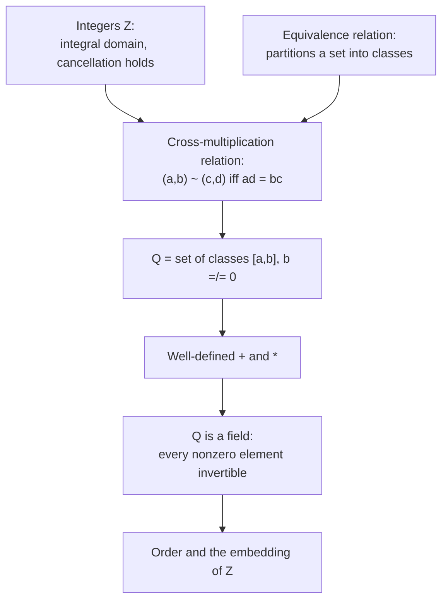

# Construction of the Rational Numbers

## A number system where every nonzero element can be divided

The integers $\mathbb{Z}$ support addition, subtraction, and multiplication, but not division. The equation $2x = 1$ has no integer solution, because no integer, multiplied by $2$, gives $1$. In the language of rings, most nonzero integers have no multiplicative inverse: $\tfrac12$ is not an integer. The genuine problem this unit solves is to enlarge $\mathbb{Z}$ into the smallest system in which every nonzero element can be inverted, so that division by any nonzero quantity becomes possible. That system is the field of rational numbers $\mathbb{Q}$.

The idea that makes the construction work is that a fraction is not a single number written in one way; it is a pair of integers, a numerator and a denominator, and many different pairs stand for the same quantity. The pairs $(1,2)$, $(2,4)$, and $(3,6)$ all name the same rational, namely one half. A rational number is therefore a numerator–denominator pair, with two pairs counted as equal exactly when they cross-multiply to the same integer. This is the same move used to build $\mathbb{Z}$, where an integer was a credit–debit pair collapsed by net balance; here the pairs are numerator and denominator, collapsed by cross-multiplication.

## Dependency map



## Recall — the objects the construction rests on

Recall from the integer construction that $\mathbb{Z}$ is an integral domain, which means a commutative ring in which no two nonzero elements multiply to give zero, that is, if a product $mn$ equals zero then at least one of $m$ or $n$ is zero. The consequence used repeatedly below is cancellation: if $mk = nk$ and $k \neq 0$, then $m = n$, because $(m-n)k = 0$ with $k \neq 0$ forces $m - n = 0$.

Recall that an equivalence relation on a set is a relation that is reflexive, symmetric, and transitive, and that such a relation partitions the set into disjoint classes, where each class collects all the elements related to one another. This is the tool that lets many pairs be treated as one number: the number is the whole class of pairs.

Recall that a field is a commutative ring with $1 \neq 0$ in which every nonzero element has a multiplicative inverse, which means for every nonzero $x$ there is a $y$ with $xy = 1$. The whole point of $\mathbb{Q}$ is to be the field that $\mathbb{Z}$ is not.

## The cross-multiplication relation

Concrete first. Write a fraction as an ordered pair of integers, the numerator first and the denominator second, with the denominator never zero. The pairs
$$(1, 2), \quad (2, 4), \quad (3, 6), \quad (-5, -10)$$
should all name one half. The feature they share is not that the numerators agree or the denominators agree, because they do not. It is that each pair cross-multiplies to the same value: $1 \cdot 4 = 2 \cdot 2$, and $2 \cdot 6 = 4 \cdot 3$, and $1 \cdot 6 = 2 \cdot 3$. Cross-multiplication is the test that decides when two pairs stand for the same rational.


**Definition — The set of pairs and the relation.**

Let $P = \{\, (a, b) : a, b \in \mathbb{Z},\ b \neq 0 \,\}$ be the set of integer pairs with nonzero second entry. Define $(a, b) \sim (c, d)$ to mean $ad = bc$.


`Type:` each $(a,b) \in P$ is an ordered pair of integers with $b \neq 0$; the relation $\sim$ is a statement about two pairs, either true or false.
`Why-this-form:` the test is $ad = bc$ rather than $a/b = c/d$ because division is not yet available; cross-multiplication states the equality $\tfrac{a}{b} = \tfrac{c}{d}$ using only integer multiplication, which we already have. The condition $b \neq 0$ is imposed because a denominator of zero would represent division by zero, which has no meaning.


**Theorem — The relation is an equivalence relation.**

On $P$, the relation $\sim$ is reflexive, symmetric, and transitive.


**Proof.**

> `Definition:` reflexive, $(a,b) \sim (a,b)$, because $ab = ba$ by commutativity of integer multiplication.
> `Algebra:` symmetric, if $(a,b) \sim (c,d)$ then $ad = bc$, so $cb = da$, which is $(c,d) \sim (a,b)$.
> `Theorem:` transitive is the one step needing cancellation. Suppose $(a,b) \sim (c,d)$ and $(c,d) \sim (e,f)$, so $ad = bc$ and $cf = de$. Multiply the first by $f$ and the second by $b$: $adf = bcf$ and $bcf = bde$, hence $adf = bde$, that is $(af)d = (be)d$. Since $d \neq 0$, cancellation in $\mathbb{Z}$ gives $af = be$, which is $(a,b) \sim (e,f)$. The place the integral-domain property is spent is exactly this cancellation of $d$.

### Section summary

The relation $\sim$ sorts the pairs into classes, each class collecting every pair that cross-multiplies to a common value. What is now true is that "the same fraction written differently" has a precise meaning: two pairs lie in one class exactly when they cross-multiply equally. What this hands forward is the definition of a rational number as one whole class, which the next section states.

## The set of rational numbers

Concrete first, modulo the relation. The class of the pair $(1,2)$ is
$$[1,2] = \{\, (1,2), (2,4), (3,6), (-1,-2), (-5,-10), \dots \,\},$$
the collection of every pair cross-multiplying to give one half. This whole set is a single rational number.


**Definition — Rational numbers.**

A rational number is an equivalence class $[a,b]$ of a pair $(a,b) \in P$ under $\sim$. The set of all such classes is $\mathbb{Q} = P / \sim$. The class $[a,b]$ is written $\dfrac{a}{b}$, and any pair inside it is a representative.


`Type:` $[a,b] \in \mathbb{Q}$ is a set of pairs, and $\mathbb{Q}$ is a set whose members are themselves sets of pairs; the integer $a$ and integer $b$ are only a chosen representative of the class, not the class itself.
`Convention:` the same class has many names, so $\tfrac{1}{2}$ and $\tfrac{2}{4}$ denote the identical rational number; an equation between fractions is an equation between classes, not between the chosen numerators and denominators.

## Well-defined addition and multiplication

Concrete first. The school rules for adding and multiplying fractions act on representatives:
$$\frac{1}{2} + \frac{1}{3} = \frac{1\cdot 3 + 2\cdot 1}{2 \cdot 3} = \frac{5}{6}, \qquad \frac{1}{2}\cdot\frac{1}{3} = \frac{1\cdot 1}{2\cdot 3} = \frac{1}{6}.$$
Repeating the sum with a different representative of $\tfrac12$, namely $\tfrac{2}{4}$, gives $\tfrac{2\cdot 3 + 4\cdot 1}{4\cdot 3} = \tfrac{10}{12}$, and $\tfrac{10}{12} = \tfrac{5}{6}$ because $10 \cdot 6 = 12 \cdot 5$. The answer is the same class. This must be proved in general, because the operations are defined through representatives and a rational has many.


**Definition — Operations on classes.**

$\dfrac{a}{b} + \dfrac{c}{d} := \dfrac{ad + bc}{bd}$ and $\dfrac{a}{b}\cdot\dfrac{c}{d} := \dfrac{ac}{bd}$.


`Type:` the outputs are again classes; the denominators $bd$ are nonzero because $b \neq 0$ and $d \neq 0$ in an integral domain, so the results are genuine members of $\mathbb{Q}$.
`Why-this-form:` the sum uses the common denominator $bd$ and combines numerators as $ad + bc$, which is the single fraction equal to $\tfrac{a}{b} + \tfrac{c}{d}$; the product multiplies numerators and denominators separately, matching how a product of two ratios behaves.


**Theorem — The operations are well-defined.**

If $\dfrac{a}{b} = \dfrac{a'}{b'}$ and $\dfrac{c}{d} = \dfrac{c'}{d'}$, then the sums and products computed from the two choices of representative are equal as classes.


Skeleton. Both parts start from $ab' = a'b$ and $cd' = c'd$, the cross-multiplication equalities of the two given class equalities. For multiplication, the load-bearing step is to multiply these two equalities together, producing exactly the cross-multiplication equality that the two products require. For addition, the same two equalities are combined after multiplying each by a matching factor, and the terms are collected into the required equality.

**Proof.**

> Hypotheses:
> $$ab' = a'b, \qquad cd' = c'd. \tag{1}$$
>
> Multiplication. The two products are $\dfrac{ac}{bd}$ and $\dfrac{a'c'}{b'd'}$; they are equal as classes exactly when $(ac)(b'd') = (bd)(a'c')$.
> $$(ac)(b'd') = (ab')(cd') = (a'b)(c'd) = (bd)(a'c'). \tag{2}$$
>
> Addition. The two sums are $\dfrac{ad+bc}{bd}$ and $\dfrac{a'd'+b'c'}{b'd'}$; they are equal as classes exactly when $(ad+bc)(b'd') = (bd)(a'd'+b'c')$.
> $$(ad + bc)(b'd') = (ab')(dd') + (cd')(bb') = (a'b)(dd') + (c'd)(bb') = (bd)(a'd' + b'c'). \tag{3}$$
>
> `Assumption:` line $(1)$ restates the two class equalities as cross-multiplications.
> `Algebra:` line $(2)$ regroups the product $(ac)(b'd')$ into $(ab')(cd')$, applies both equalities from $(1)$ to replace $ab'$ by $a'b$ and $cd'$ by $c'd$, then regroups to $(bd)(a'c')$. So the two products are the same class.
> `Algebra:` line $(3)$ expands the left side, applies $(1)$ to each term to replace $ab'$ by $a'b$ and $cd'$ by $c'd$, and collects into $(bd)(a'd'+b'c')$. So the two sums are the same class. $\blacksquare$
>
> `Direct:` the two operations are now functions on $\mathbb{Q}$, not merely on representatives, so any convenient representative may be used in a computation.

## The field of rational numbers

Concrete first. The rational $\tfrac{0}{1}$ leaves every rational unchanged under addition, since $\tfrac{a}{b} + \tfrac{0}{1} = \tfrac{a}{b}$. The rational $\tfrac{1}{1}$ leaves every rational unchanged under multiplication. The additive opposite of $\tfrac{a}{b}$ is $\tfrac{-a}{b}$, since their sum is $\tfrac{ab - ba}{b^2} = \tfrac{0}{b^2} = \tfrac01$. The multiplicative inverse of a nonzero $\tfrac{a}{b}$ is $\tfrac{b}{a}$, since $\tfrac{a}{b}\cdot\tfrac{b}{a} = \tfrac{ab}{ab} = \tfrac{1}{1}$; this is where division is finally available.


**Theorem — Q is a field.**

Under the operations above, $\mathbb{Q}$ is a field: addition is associative and commutative with identity $\tfrac01$ and inverse $\tfrac{-a}{b}$, multiplication is associative and commutative with identity $\tfrac11$, multiplication distributes over addition, and every nonzero $\tfrac{a}{b}$ has the inverse $\tfrac{b}{a}$.


**Proof.**

> `Depends-on:` the ring axioms transfer from $\mathbb{Z}$ through the definitions, by the same one-line pattern used for $\mathbb{Z}/n\mathbb{Z}$: each identity between classes reduces to an identity between the integer numerators and denominators, which holds in $\mathbb{Z}$.

`Type:` a rational $\tfrac{a}{b}$ is nonzero exactly when $a \neq 0$, because $\tfrac{a}{b} = \tfrac01$ means $a \cdot 1 = b \cdot 0 = 0$; so for a nonzero class the inverse $\tfrac{b}{a}$ has a nonzero denominator and is a genuine rational. This is the step $\mathbb{Z}$ could not take, and it is the reason $\mathbb{Q}$ is a field while $\mathbb{Z}$ is only an integral domain.

### Section summary

The object built is $\mathbb{Q}$, a field containing an inverse for every nonzero element. What is now true that was not before is that division by any nonzero rational is defined, so equations like $2x = 1$ are solvable. What this hands forward is that $\mathbb{Q}$ still needs to be compared and ordered, and that the integers must be located inside it, which the next section supplies.

## Order and the embedding of the integers

Concrete first. To compare $\tfrac{1}{2}$ and $\tfrac{2}{3}$, write both over a positive common denominator and compare numerators: $\tfrac{1}{2} = \tfrac{3}{6}$ and $\tfrac{2}{3} = \tfrac46$, and $3 < 4$, so $\tfrac12 < \tfrac23$. The comparison uses cross-multiplication with positive denominators.


**Definition — Order on Q.**

Represent each rational with a positive denominator, which is always possible since $\tfrac{a}{b} = \tfrac{-a}{-b}$. For $\tfrac{a}{b}$ and $\tfrac{c}{d}$ with $b, d > 0$, define $\tfrac{a}{b} < \tfrac{c}{d}$ to mean $ad < bc$.


`Convention:` the denominators are taken positive first, because multiplying an inequality by a negative integer reverses it; fixing positive denominators makes the test $ad < bc$ direct and unambiguous.
`Depends-on:` this order is well-defined and total, and it is compatible with the operations, so $\mathbb{Q}$ is an ordered field; the checks are the same representative-independence pattern as the operations and rest on the order of $\mathbb{Z}$.


**Theorem — Z embeds in Q.**

The map $n \mapsto \tfrac{n}{1}$ sends $\mathbb{Z}$ into $\mathbb{Q}$ and preserves addition, multiplication, and order.


**Proof.**

> `Algebra:` $\tfrac{m}{1} + \tfrac{n}{1} = \tfrac{m+n}{1}$ and $\tfrac{m}{1}\cdot\tfrac{n}{1} = \tfrac{mn}{1}$, and $m < n$ gives $\tfrac{m}{1} < \tfrac{n}{1}$; the map is also injective, since $\tfrac{m}{1} = \tfrac{n}{1}$ forces $m = n$. So $\mathbb{Q}$ contains a faithful copy of $\mathbb{Z}$, and the integer $n$ is identified with the rational $\tfrac{n}{1}$.

`Isomorphism:` after this identification the symbol $n$ denotes both an integer and the rational $\tfrac{n}{1}$; the two are different objects (an integer is a credit–debit class, the rational is a numerator–denominator class), but they behave identically under $+$, $\times$, and $<$, so treating them as one is safe.

## Computation

Mechanism by hand. To add two rationals, put them over a common denominator, add numerators, then reduce to lowest terms by dividing numerator and denominator by their greatest common divisor. Reducing uses the Euclidean algorithm from the previous unit. Example: $\tfrac{4}{6} + \tfrac{9}{6} = \tfrac{13}{6}$, already in lowest terms since $\gcd(13,6) = 1$; and $\tfrac{2}{6} = \tfrac{1}{3}$ after dividing by $\gcd(2,6) = 2$.

```python
from math import gcd


def normalize(a: int, b: int) -> tuple[int, int]:
    """Return the lowest-terms representative of a/b with positive denominator.

    Divides out gcd(a, b) and moves any sign to the numerator, so each rational
    has one canonical (numerator, denominator) pair. Requires b != 0.
    """
    if b == 0:
        raise ZeroDivisionError("denominator must be nonzero")
    g = gcd(a, b)
    a, b = a // g, b // g
    if b < 0:                      # keep the denominator positive
        a, b = -a, -b
    return a, b


def add(p: tuple[int, int], q: tuple[int, int]) -> tuple[int, int]:
    """Add two rationals given as (numerator, denominator) pairs."""
    a, b = p
    c, d = q
    return normalize(a * d + b * c, b * d)   # common denominator b*d


def mul(p: tuple[int, int], q: tuple[int, int]) -> tuple[int, int]:
    """Multiply two rationals given as (numerator, denominator) pairs."""
    a, b = p
    c, d = q
    return normalize(a * c, b * d)
# production: use fractions.Fraction, which stores exactly this normalized pair.
```

`Representable:` a rational is stored exactly as a pair of integers, so rational arithmetic is exact; a floating-point number cannot represent $\tfrac13$ exactly, because $\tfrac13$ is not a finite sum of powers of two, so `1/3` in floating point is a nearby value and `0.1 + 0.2 == 0.3` is false. Using integer pairs, or `fractions.Fraction`, avoids this.
`Overflow:` numerators and denominators grow under repeated addition if not reduced, so reducing by the gcd after every operation keeps them small; in a fixed-width integer type, skipping the reduction overflows.

## Examples

**Easy.** Add $\tfrac12 + \tfrac13$. By hand, common denominator $6$: $\tfrac36 + \tfrac26 = \tfrac56$.
```python
add((1, 2), (1, 3))   # -> (5, 6)
```

**Moderate.** Multiply and reduce $\tfrac46 \cdot \tfrac{3}{8}$. By hand, $\tfrac{12}{48} = \tfrac{1}{4}$ after dividing by $\gcd(12,48) = 12$.
```python
mul((4, 6), (3, 8))   # -> (1, 4)
```

**Hard, a compound fraction.** Simplify $\dfrac{\tfrac12 + \tfrac13}{\tfrac14}$. By hand, the numerator is $\tfrac56$, and dividing by $\tfrac14$ multiplies by its inverse $\tfrac41$: $\tfrac56 \cdot \tfrac41 = \tfrac{20}{6} = \tfrac{10}{3}$.
```python
mul(add((1, 2), (1, 3)), (4, 1))   # -> (10, 3)
```

**Edge case, sign normalization.** The pair $(3, -4)$ has a negative denominator; its canonical form moves the sign up, giving $\tfrac{-3}{4}$. By hand, $\tfrac{3}{-4} = \tfrac{-3}{4}$ because $3 \cdot 4 = (-4)(-3)$.
```python
normalize(3, -4)   # -> (-3, 4)
```

**Counterexample A, zero denominator.** The pair $(1, 0)$ is not a rational, because a zero denominator represents division by zero, which is undefined. Failure mode: the defining condition $b \neq 0$ is violated, so no class exists.
```python
normalize(1, 0)   # -> ZeroDivisionError
```

**Counterexample B, floating point is not exact rational arithmetic.** Adding $\tfrac{1}{10} + \tfrac{2}{10}$ as rationals gives exactly $\tfrac{3}{10}$, but the same sum in floating point does not equal the float for $\tfrac{3}{10}$. Failure mode: $\tfrac{1}{10}$ and $\tfrac{3}{10}$ are not representable in binary floating point, a different failure from A, which was an illegal input rather than a representation error.
```python
add((1, 10), (2, 10)), (0.1 + 0.2 == 0.3)   # -> ((3, 10), False)
```

**Disguised use, a slope.** The slope of the line through $(1,2)$ and $(4,8)$ is the rational $\tfrac{8-2}{4-1} = \tfrac63 = \tfrac21 = 2$; slopes, odds ratios, and probabilities are all rational numbers built from integer pairs. By hand the slope reduces to $2$.
```python
normalize(8 - 2, 4 - 1)   # -> (2, 1)
```

**Application, gear ratios.** A gear with $12$ teeth driving a gear with $30$ teeth turns at the rational rate $\tfrac{12}{30} = \tfrac{2}{5}$ of the driver, so the output makes two turns for every five of the input. Domain: mechanical engineering. By hand, $\gcd(12,30) = 6$ reduces $\tfrac{12}{30}$ to $\tfrac{2}{5}$.
```python
normalize(12, 30)   # -> (2, 5)
```

## Summary

`For:` the topic enlarges $\mathbb{Z}$ into the field $\mathbb{Q}$, in which every nonzero element has an inverse, so division becomes possible and equations like $2x = 1$ are solvable; this answers the opening need that $\mathbb{Z}$ cannot divide.

`Assumes:` that $\mathbb{Z}$ is an integral domain, spent at the transitivity proof where the factor $d$ is cancelled, and again wherever a class identity reduces to an integer identity; and the machinery of equivalence relations, spent in forming the classes.

`Produces:` the rationals $\mathbb{Q} = P/\sim$ as classes of integer pairs under cross-multiplication; well-defined field operations; the order making $\mathbb{Q}$ an ordered field; and the embedding identifying each integer $n$ with $\tfrac{n}{1}$, so $\mathbb{Z} \subset \mathbb{Q}$.

`Pattern-match:` recognize this construction, a set of pairs collapsed by an equivalence relation into a field of fractions, wherever a ring is enlarged to allow division; it is the field of fractions of any integral domain, of which $\mathbb{Q}$ from $\mathbb{Z}$ is the first case. Carry forward the one thing $\mathbb{Q}$ still lacks, that it has gaps where limits should sit, which the next note exposes in [[The Incompleteness of the Rationals]].
