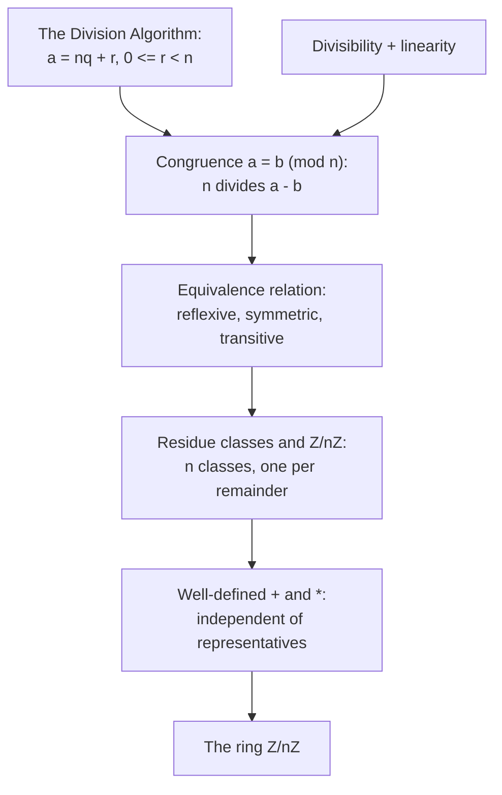

# Congruence and Modular Arithmetic

## The need — remainders as a self-contained arithmetic

Many questions depend not on an integer itself but only on its remainder after division by a fixed number. A clock shows this: three hours after $11$ o'clock the clock reads $2$, not $14$, because only the remainder on division by $12$ is kept. The same holds for the day of the week after a given number of days (division by $7$) and for checking a long multiplication by its last digit (division by $10$).

The genuine problem is that "having the same remainder modulo $n$" is used as if it were an equation, yet a remainder is a by-product of division, not an object we can add and multiply directly. This unit turns "same remainder modulo $n$" into a relation with its own arithmetic, so that sums and products of remainders are defined and behave like ordinary sums and products. The notation and this viewpoint are due to Gauss, in the Disquisitiones Arithmeticae.

## Dependency map



## The congruence relation

Concrete first. On a $12$-hour clock, $15$ o'clock reads the same as $3$ o'clock, because $15 - 3 = 12$ is a whole number of full turns. In the same way $27$ and $3$ read alike, because $27 - 3 = 24 = 2 \cdot 12$. The common feature is that the difference is a multiple of $12$.


**Definition — Congruence modulo n.**

For a positive integer $n$, integers $a$ and $b$ are congruent modulo $n$, written $a \equiv b \pmod{n}$, when $n \mid (a - b)$.


`Type:` $a, b \in \mathbb{Z}$ and $n \in \mathbb{Z}_{>0}$; the symbol $\equiv$ is a relation between two integers, either true or false, not an operation producing a third integer.
`Why-this-form:` the definition is stated as $n \mid (a - b)$ because that form is checked by one divisibility test and connects directly to [Divisibility](../unique-factorization/Divisibility/) and its linearity; the equivalent phrasing "same remainder on division by $n$" is proved next, so both descriptions are available.

The remainder description, proved. Recall from [The Division Algorithm](../unique-factorization/The%20Division%20Algorithm/) that dividing by $n$ gives a unique remainder in $\{0, 1, \dots, n-1\}$. Write $a = nq_1 + r_1$ and $b = nq_2 + r_2$ with $0 \le r_1, r_2 < n$. Then $a - b = n(q_1 - q_2) + (r_1 - r_2)$, so $n \mid (a - b)$ holds exactly when $n \mid (r_1 - r_2)$. Since $r_1 - r_2$ lies strictly between $-n$ and $n$, the only multiple of $n$ it can be is $0$, so $n \mid (a-b)$ holds exactly when $r_1 = r_2$. Therefore $a \equiv b \pmod n$ means precisely that $a$ and $b$ leave the same remainder on division by $n$.


**Theorem — Congruence is an equivalence relation.**

For each fixed $n$, the relation $\equiv \pmod n$ is reflexive, symmetric, and transitive.


**Proof.**

> `Definition:` reflexive, $a \equiv a$, because $n \mid (a - a) = 0$ and every integer divides $0$.
> `Algebra:` symmetric, if $a \equiv b$ then $n \mid (a - b)$, so $n \mid -(a-b) = (b - a)$, giving $b \equiv a$.
> `Theorem:` transitive, if $a \equiv b$ and $b \equiv c$ then $n \mid (a-b)$ and $n \mid (b-c)$, so by linearity (from [Divisibility](../unique-factorization/Divisibility/)) $n \mid [(a-b) + (b-c)] = (a - c)$, giving $a \equiv c$.

This section leaves one thing forced: an equivalence relation partitions the integers into disjoint classes, and those classes, not the individual integers, are the objects the arithmetic will act on. The next section names them.

## Residue classes and the set Z/nZ

Concrete first, modulo $5$. The integers congruent to $2$ are those differing from $2$ by a multiple of $5$:
$$\dots, -8, -3, 2, 7, 12, 17, \dots$$
This whole collection is one object, the residue class of $2$. Sorting every integer this way produces exactly five classes, one for each possible remainder $0, 1, 2, 3, 4$, and every integer lands in exactly one.


**Definition — Residue class and the set Z/nZ.**

The residue class of $a$ modulo $n$ is $[a]_n = \{\, a + kn : k \in \mathbb{Z} \,\}$, the set of all integers congruent to $a$. The set of all residue classes modulo $n$ is $\mathbb{Z}/n\mathbb{Z} = \{\, [0], [1], \dots, [n-1] \,\}$.


`Type:` $[a]_n$ is a set of integers, and $\mathbb{Z}/n\mathbb{Z}$ is a set whose members are themselves sets; it has exactly $n$ members.
`Depends-on:` [The Division Algorithm](../unique-factorization/The%20Division%20Algorithm/) guarantees each integer has a unique remainder in $\{0, \dots, n-1\}$, so each integer lies in exactly one class and the $n$ listed classes are distinct and exhaust every integer.
`Convention:` a class is named by any one of its members, so $[2]_5$ and $[7]_5$ are two names for the same class. The member used to name a class is called a representative, and the representative is a choice, not part of the object.

The next section is forced by a mismatch: the classes are the objects we want to add and multiply, but the only addition and multiplication in hand act on integers, that is, on representatives. Defining operations on classes through representatives is only legitimate if the answer does not depend on which representative is chosen, and that independence is a claim requiring proof.

## Well-defined addition and multiplication

Concrete first, modulo $5$. Define the sum of $[2]$ and $[4]$ by adding representatives: $[2] + [4] = [2 + 4] = [6] = [1]$. Now repeat with different representatives of the same two classes, $7 \in [2]$ and $9 \in [4]$: $[7] + [9] = [16] = [1]$. The answer $[1]$ is the same. The product behaves the same way: $[2][4] = [8] = [3]$ and $[7][9] = [63] = [3]$.


**Definition — Operations on residue classes.**

$[a] + [b] := [a + b]$ and $[a]\,[b] := [ab]$.


`Why-this-form:` the operations are defined by acting on representatives and re-forming the class, because that is the only material available; the definition is provisional until the choice of representative is shown not to matter.


**Theorem — The operations are well-defined.**

If $a \equiv a' \pmod n$ and $b \equiv b' \pmod n$, then $a + b \equiv a' + b' \pmod n$ and $ab \equiv a'b' \pmod n$.


Skeleton. Both parts start from $n \mid (a - a')$ and $n \mid (b - b')$. For the sum, write the difference of sums as a sum of these two differences and apply linearity. For the product, the load-bearing step is to insert and cancel a mixed term $a'b$, which splits the difference $ab - a'b'$ into two pieces each visibly divisible by $n$.

**Proof.**

> Set up the hypotheses:
> $$n \mid (a - a'), \qquad n \mid (b - b'). \tag{1}$$
>
> Addition:
> $$(a + b) - (a' + b') = (a - a') + (b - b'). \tag{2}$$
>
> Multiplication:
> $$ab - a'b' = ab - a'b + a'b - a'b' = (a - a')\,b + a'\,(b - b'). \tag{3}$$
>
> `Assumption:` line $(1)$ restates the two congruences as divisibilities.
> `Algebra:` line $(2)$ regroups the difference of the sums into the two differences from $(1)$; by linearity (from [Divisibility](../unique-factorization/Divisibility/)) $n$ divides their sum, so $a + b \equiv a' + b' \pmod n$.
> `Algebra:` line $(3)$ is the load-bearing step: adding and subtracting the mixed term $a'b$ splits $ab - a'b'$ into $(a - a')b$ and $a'(b - b')$. By $(1)$, $n$ divides $a - a'$ and $b - b'$, so it divides each product $(a-a')b$ and $a'(b-b')$, and by linearity it divides their sum. Therefore $ab \equiv a'b' \pmod n$. $\blacksquare$
>
> `Direct:` the two operations are now functions on $\mathbb{Z}/n\mathbb{Z}$, not merely on representatives, so from here a class may be replaced by any convenient representative during a computation.

This section hands forward a set of $n$ objects with a well-defined addition and multiplication. What is not yet stated is which arithmetic laws these operations obey, and that is settled by reading the laws off the integers.

## The ring Z/nZ

Concrete first, modulo $5$. Addition and multiplication tables are closed and mirror integer arithmetic: $[3] + [4] = [2]$, $[3][4] = [2]$, $[1]$ is unchanged under multiplication ($[1][a] = [a]$), and $[0]$ is unchanged under addition. Every class $[a]$ has an additive opposite $[-a] = [n - a]$, for instance $[3] + [2] = [0]$ modulo $5$.


**Theorem — Z/nZ is a commutative ring with identity.**

Under $[a] + [b] = [a+b]$ and $[a][b] = [ab]$, the set $\mathbb{Z}/n\mathbb{Z}$ is a commutative ring: addition is associative and commutative with identity $[0]$ and additive inverse $[-a]$, multiplication is associative and commutative with identity $[1]$, and multiplication distributes over addition.


**Proof.**

> `Depends-on:` each axiom transfers from the corresponding axiom in $\mathbb{Z}$ through the definition of the operations. For associativity of addition, $([a]+[b])+[c] = [(a+b)+c] = [a+(b+c)] = [a]+([b]+[c])$, where the middle equality is associativity in $\mathbb{Z}$. The other axioms transfer by the identical one-line pattern, so the ring laws hold because they hold in $\mathbb{Z}$ and the operations are defined by representatives.

`POV:` $\mathbb{Z}/n\mathbb{Z}$ is the quotient ring of $\mathbb{Z}$ by the set of multiples of $n$; naming this places the object inside ring theory, where quotient constructions are general, though that general construction is a separate topic and is only named here.
`None:` no further alternate viewpoint is added, because the two available descriptions, the class of integers with a common remainder and the quotient ring, already cover the object and nothing new is enabled by a third.


**Distinction — The class versus a representative.**

$[a]$ is a set of infinitely many integers; $a$ is one integer inside it. Writing $[7] = [2]$ modulo $5$ is correct because it equates two sets, while $7 = 2$ is false. A computation may replace $a$ by any representative of $[a]$, but the equality that results is an equality of classes, not of integers.


### Section summary

The object built is $\mathbb{Z}/n\mathbb{Z}$, a set of $n$ residue classes carrying a well-defined addition and multiplication that obey all the commutative-ring laws, inherited from $\mathbb{Z}$. What is now true that was not before is that remainders modulo $n$ can be added and multiplied as first-class objects, with $[0]$ and $[1]$ as identities and $[-a]$ as the additive inverse of $[a]$. What this hands forward is a single open question about multiplication: additive inverses always exist, but multiplicative inverses do not always exist, and deciding which classes are invertible is the subject of the next note.

## Computation

Mechanism by hand. To compute in $\mathbb{Z}/n\mathbb{Z}$, replace each integer by its remainder on division by $n$, carry out the ordinary operation, then reduce the result modulo $n$. To compute a power $a^k \bmod n$, reduce after each multiplication rather than forming the huge integer $a^k$ first, so the numbers stay below $n^2$ throughout. Example: $7^{100} \bmod 5$ reduces first to $2^{100} \bmod 5$; since $2^4 = 16 \equiv 1$, and $100 = 4 \cdot 25$, the power is $(2^4)^{25} \equiv 1^{25} = 1$.

```python
def mod_reduce(a: int, n: int) -> int:
    """Return the canonical representative of [a] in {0, ..., n-1}.

    Uses Python's % operator, which already returns a nonnegative remainder
    for positive n, matching the division-algorithm remainder.
    """
    return a % n


def mod_pow(a: int, k: int, n: int) -> int:
    """Return a**k mod n by reducing after every multiplication.

    Implemented from raw multiplication (not the a**k-then-reduce shortcut)
    to show the mechanism that keeps intermediates small: each step stays
    below n*n. For production, Python's built-in pow(a, k, n) does the same
    with square-and-multiply.
    """
    result = 1
    base = a % n
    for _ in range(k):
        result = (result * base) % n     # reduce immediately, never store a**k
    return result


import numpy as np
def mod_reduce_array(xs, n: int):
    """Reduce a 1-D integer array modulo n, shape (m,) in and (m,) out.

    Array-API style: one vectorized remainder over the whole grid rather
    than a Python loop, so it runs unchanged on any conforming array library.
    """
    xp = np.asarray(xs)                  # shape (m,)
    return xp % n
```

`Overflow:` in a fixed-width integer type, forming $a^k$ before reducing overflows the machine word for even moderate $k$; reducing after each multiplication keeps every intermediate below $n^2$ and avoids it. Python's integers are unbounded, so the failure there is speed and memory rather than overflow, but the same fix (reduce as you go, or call `pow(a, k, n)`) applies.
`Representable:` the canonical representatives $\{0, \dots, n-1\}$ are exact integers, so modular arithmetic carries no round-off; this is arithmetic without the floating-point traps, which is one reason it underlies cryptography.

## Examples

**Easy.** Reduce $17$ modulo $5$. By hand, $17 = 5 \cdot 3 + 2$, so $17 \equiv 2 \pmod 5$ and $[17] = [2]$.
```python
mod_reduce(17, 5)   # -> 2
```

**Easy, operations.** Add and multiply classes modulo $5$. By hand, $[3] + [4] = [7] = [2]$ and $[3][4] = [12] = [2]$.
```python
(3 + 4) % 5, (3 * 4) % 5   # -> (2, 2)
```

**Moderate.** Compute $7^{100} \bmod 5$. By hand, $7 \equiv 2$, and $2^4 \equiv 1$, so $2^{100} = (2^4)^{25} \equiv 1$.
```python
mod_pow(7, 100, 5)   # -> 1   (matches pow(7, 100, 5))
```

**Hard.** Compute $2^{100} \bmod 7$. By hand, the powers of $2$ modulo $7$ cycle $2, 4, 1$ with length $3$; since $100 = 3 \cdot 33 + 1$, the result is the first entry, $2^{100} \equiv 2^1 = 2$.
```python
mod_pow(2, 100, 7)   # -> 2
```

**Edge case, $n = 1$.** Modulo $1$, every integer is divisible by $1$, so every difference $a - b$ is a multiple of $1$ and all integers are congruent. There is a single class $[0]$, and $\mathbb{Z}/1\mathbb{Z}$ is the zero ring, in which $[0] = [1]$. By hand, $[a] = [0]$ for every $a$.
```python
{a % 1 for a in range(-3, 4)}   # -> {0}
```

**Counterexample A, cancellation fails.** In $\mathbb{Z}$, $ac = bc$ with $c \neq 0$ gives $a = b$. Modulo $6$ this fails: $[2][1] = [2]$ and $[2][4] = [8] = [2]$, so $[2][1] = [2][4]$, yet $[1] \neq [4]$. Failure mode: cancelling the factor $[2]$ is invalid because $\gcd(2, 6) \neq 1$, so $[2]$ is not invertible; the computation confirms it.
```python
(2 * 1) % 6, (2 * 4) % 6   # -> (2, 2), but 1 != 4 mod 6
```

**Counterexample B, exponents do not reduce modulo $n$.** A different error is to reduce the exponent modulo $n$. Modulo $3$, the base may be reduced, but $2^5 \bmod 3 = 32 \bmod 3 = 2$, while reducing the exponent $5$ to $5 \bmod 3 = 2$ gives $2^2 = 4 \equiv 1$. So $2^5 \not\equiv 2^2 \pmod 3$. Failure mode: the exponent must be reduced modulo the order of the base, not modulo $n$; the order is introduced with Euler's theorem in a later note.
```python
pow(2, 5, 3), pow(2, 2, 3)   # -> (2, 1): reducing the exponent mod 3 is wrong
```

**Disguised use, casting out nines.** The rule that a decimal number is congruent to its digit sum modulo $9$ is a congruence statement, because $10 \equiv 1 \pmod 9$ makes each place value $10^k \equiv 1$, so the number is congruent to the sum of its digits. Checking a product by comparing digit sums modulo $9$ is modular arithmetic under another name. By hand, $12 \times 13 = 156$; digit sums give $3 \times 4 = 12 \equiv 3$ and $1 + 5 + 6 = 12 \equiv 3$, consistent.
```python
def digit_sum_mod9(m: int) -> int:
    return m % 9
digit_sum_mod9(12 * 13), digit_sum_mod9(156)   # -> (3, 3)
```

**Application, check digits (error-detecting codes).** The ISBN-10 check digit is chosen so that $\sum_{i=1}^{10} i \cdot d_i \equiv 0 \pmod{11}$, where $d_i$ are the digits. A single wrong digit or a swap of two digits changes the weighted sum modulo $11$ and is detected. By hand, for digits $0,3,0,6,4,0,6,1,5,2$ the weighted sum is $\sum i\, d_i = 176 = 11 \cdot 16 \equiv 0$, so the code checks out. Domain: error-detecting codes.
```python
d = [0, 3, 0, 6, 4, 0, 6, 1, 5, 2]
sum((i + 1) * d[i] for i in range(10)) % 11   # -> 0
```

## Summary

`For:` the topic makes "same remainder modulo $n$" into a relation with its own arithmetic, so remainders can be added and multiplied as objects; this answers the opening need that clock-, calendar-, and checksum-style questions depend only on remainders.

`Assumes:` [The Division Algorithm](../unique-factorization/The%20Division%20Algorithm/) for the unique remainder that makes the $n$ classes distinct and exhaustive, spent at the residue-class definition, and [Divisibility](../unique-factorization/Divisibility/) linearity, spent at the equivalence-relation proof and at the well-definedness proof, line $(3)$, where the mixed-term split reduces to two divisibilities.

`Produces:` the congruence relation $a \equiv b \pmod n$; the residue classes and the set $\mathbb{Z}/n\mathbb{Z}$ of $n$ classes; well-defined class addition and multiplication; and the commutative ring $\mathbb{Z}/n\mathbb{Z}$ with identities $[0]$ and $[1]$ and additive inverses $[-a]$.

`Pattern-match:` recognize modular arithmetic wherever a problem keeps only remainders (clocks, calendars, parity, check digits, hashing) or wherever an equation is asserted "modulo" something; recognize the well-definedness question wherever an operation is defined on classes through representatives, since it must always be checked; and carry forward the one gap this note leaves, that multiplicative inverses need not exist, which the next note resolves in [Modular Inverses and Linear Congruences](Modular%20Inverses%20and%20Linear%20Congruences/).
