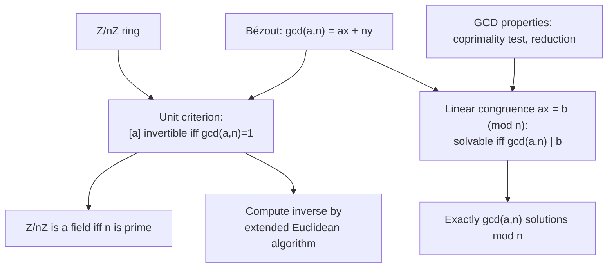

# Modular Inverses and Linear Congruences

## The need — when can you divide, and solve, modulo n

[Congruence and Modular Arithmetic](Congruence%20and%20Modular%20Arithmetic/) built the ring $\mathbb{Z}/n\mathbb{Z}$ and left one gap: additive inverses always exist, but multiplicative inverses do not. Modulo $6$ the class $[2]$ has no class $[x]$ with $[2][x] = [1]$, so there is no way to divide by $2$. The genuine problem is to decide exactly which classes are invertible, and then to solve the basic equation $ax \equiv b \pmod n$, which asks for an $x$ whose scaled value lands in a target class. This note settles both, and the deciding quantity is the greatest common divisor.

## Dependency map



## Units and the inverse criterion

Concrete first. Modulo $7$, the class $[3]$ has an inverse: $[3][5] = [15] = [1]$, so $[5]$ undoes multiplication by $[3]$. Modulo $6$, the class $[2]$ has none: the products $[2][0], [2][1], \dots, [2][5]$ are $[0], [2], [4], [0], [2], [4]$, and $[1]$ never appears. The difference is that $\gcd(3,7) = 1$ while $\gcd(2,6) = 2$.


**Definition — Unit and inverse in Z/nZ.**

A class $[a]$ is a unit when there is a class $[x]$ with $[a][x] = [1]$; that $[x]$ is the multiplicative inverse, written $[a]^{-1}$. The set of units is $(\mathbb{Z}/n\mathbb{Z})^\times$.


`Type:` $[a], [x] \in \mathbb{Z}/n\mathbb{Z}$; a unit is a class, and being a unit is a property of the class, not of a chosen representative, because the operations are well-defined.


**Theorem — Inverse criterion.**

$[a]$ is a unit in $\mathbb{Z}/n\mathbb{Z}$ if and only if $\gcd(a, n) = 1$.


**Proof.**

> $$\gcd(a,n) = 1 \iff ax + ny = 1 \text{ for some } x, y \in \mathbb{Z} \tag{1}$$
> $$ax + ny = 1 \implies ax \equiv 1 \pmod n \tag{2}$$
> $$[a][x] = [1] \implies ax - 1 = ny \implies ax - ny = 1 \tag{3}$$
>
> `Depends-on:` line $(1)$ is the coprimality test from [GCD Properties and Coprimality](../unique-factorization/GCD%20Properties%20and%20Coprimality/), itself resting on [Bézout's Identity](../unique-factorization/Be%CC%81zout%27s%20Identity/).
> `Algebra:` line $(2)$ reads $ax + ny = 1$ modulo $n$: the term $ny$ is divisible by $n$, so $ax \equiv 1$, meaning $[x] = [a]^{-1}$. This proves coprime implies unit.
> `Algebra:` line $(3)$ is the converse: if $[a][x] = [1]$ then $ax \equiv 1 \pmod n$, so $ax - 1$ is a multiple of $n$, giving $ax - ny = 1$; by the coprimality test $(1)$ this forces $\gcd(a, n) = 1$. $\blacksquare$

`Convention:` the inverse is a class, and within $\{0, \dots, n-1\}$ it is unique, because two inverses $[x], [x']$ satisfy $[x] = [x][a][x'] = [x']$; so "the" inverse is well-defined.

### Section summary

The invertible classes are exactly the classes coprime to $n$, and they form the unit group $(\mathbb{Z}/n\mathbb{Z})^\times$. What is now true is that division by $[a]$ is possible precisely when $\gcd(a,n) = 1$. The count of units, the size of $(\mathbb{Z}/n\mathbb{Z})^\times$, is the number of integers in $\{1, \dots, n\}$ coprime to $n$; that count is Euler's totient $\varphi(n)$, defined and used in [Fermat's Little Theorem, Euler's Theorem, and the Totient](Fermat%27s%20Little%20Theorem%2C%20Euler%27s%20Theorem%2C%20and%20the%20Totient/). What this hands forward is the special case where every nonzero class is a unit, which happens exactly for a prime modulus.

## The field case and zero divisors

Concrete first. Modulo the prime $5$, every nonzero class is a unit: $[1]^{-1} = [1]$, $[2]^{-1} = [3]$, $[4]^{-1} = [4]$. Modulo the composite $6$, the classes $[2]$ and $[3]$ are nonzero yet $[2][3] = [6] = [0]$, so their product is zero although neither is; these are zero divisors, and a zero divisor can never be a unit.


**Theorem — Z/nZ is a field exactly when n is prime.**

$\mathbb{Z}/n\mathbb{Z}$ is a field if and only if $n$ is prime.


**Proof.**

> `Theorem:` if $n = p$ is prime, then every $a$ with $1 \le a \le p-1$ satisfies $\gcd(a, p) = 1$, because a prime shares no factor above $1$ with a smaller positive integer; so every nonzero class is a unit by the inverse criterion, which is the definition of a field. If $n$ is composite, write $n = ab$ with $1 < a, b < n$; then $[a] \neq [0]$ and $[b] \neq [0]$ but $[a][b] = [n] = [0]$, so $[a]$ is a zero divisor and has no inverse, and $\mathbb{Z}/n\mathbb{Z}$ is not a field. $\blacksquare$

`Cross-domain:` this identifies the finite fields $\mathbb{Z}/p\mathbb{Z}$, written $\mathbb{F}_p$, which are the base objects of coding theory and of elliptic-curve cryptography; naming the structure places it, and its general theory is a separate topic.

The unit criterion answers "when can I divide," but the sharper question is to solve $ax \equiv b \pmod n$ even when $[a]$ is not a unit. That needs the divisor $\gcd(a,n)$ to interact with $b$, which the next section works out.

## The linear congruence ax = b (mod n)

Concrete first, an invertible case. Solve $3x \equiv 4 \pmod 7$. Since $\gcd(3,7) = 1$, multiply both sides by $[3]^{-1} = [5]$: $x \equiv 5 \cdot 4 = 20 \equiv 6 \pmod 7$. Check: $3 \cdot 6 = 18 \equiv 4$. There is exactly one solution class.

Concrete first, a non-invertible case. Solve $2x \equiv 3 \pmod 4$. The left side $2x$ is always even, so $2x \bmod 4 \in \{0, 2\}$, never $3$; there is no solution. The obstruction is $\gcd(2,4) = 2$, which does not divide $3$.


**Theorem — Solvability and count.**

The congruence $ax \equiv b \pmod n$ has a solution if and only if $g \mid b$, where $g = \gcd(a, n)$. When it is solvable, the solutions form exactly $g$ distinct classes modulo $n$.


Skeleton. Rewrite the congruence as the linear equation $ax - ny = b$, whose solvability is governed by the gcd through Bézout's combination set. For the count, the load-bearing step is to divide the whole congruence by $g$, producing a congruence with coprime coefficient and modulus $n/g$ that has one solution, and then count how many classes modulo $n$ collapse to that one class modulo $n/g$.

**Proof.**

> Solvability:
> $$ax \equiv b \pmod n \iff ax - b = ny \iff ax - ny = b \tag{4}$$
>
> `Algebra:` line $(4)$ turns the congruence into a two-variable linear equation in $x, y$.
> `Depends-on:` by the combination set in [Bézout's Identity](../unique-factorization/Be%CC%81zout%27s%20Identity/), the values of $ax - ny$ are exactly the multiples of $g = \gcd(a, n)$, so $ax - ny = b$ has an integer solution if and only if $g \mid b$.
>
> Count, assuming $g \mid b$:
> $$\frac{a}{g}\,x \equiv \frac{b}{g} \pmod{\frac{n}{g}}, \qquad \gcd\!\left(\tfrac{a}{g}, \tfrac{n}{g}\right) = 1 \tag{5}$$
> $$x \equiv x_0 \pmod{\tfrac{n}{g}} \tag{6}$$
> $$x_0,\ x_0 + \tfrac{n}{g},\ x_0 + 2\tfrac{n}{g},\ \dots,\ x_0 + (g-1)\tfrac{n}{g} \tag{7}$$
>
> `Algebra:` line $(5)$ divides the congruence and the modulus by $g$; the new coefficient and modulus are coprime by the reduction fact in [GCD Properties and Coprimality](../unique-factorization/GCD%20Properties%20and%20Coprimality/).
> `Theorem:` line $(6)$ solves $(5)$: a coprime coefficient is a unit modulo $n/g$, so there is exactly one solution class $x_0$ modulo $n/g$.
> `Theorem:` line $(7)$ counts: the single class modulo $n/g$ splits into $g$ classes modulo $n$, namely $x_0 + k(n/g)$ for $k = 0, 1, \dots, g-1$, and these are distinct modulo $n$ and exhaust the solutions. So there are exactly $g$ solution classes. $\blacksquare$

## Computing the inverse and the solution

Mechanism by hand. To invert $[a]$ modulo $n$ when $\gcd(a,n) = 1$, run the extended Euclidean algorithm on $a$ and $n$ to get $ax + ny = 1$; then $[a]^{-1} = [x]$. To solve $ax \equiv b \pmod n$ in the coprime case, the solution is $x \equiv a^{-1} b$. Example: invert $3$ modulo $7$. The extended algorithm gives $3 \cdot 5 + 7 \cdot (-2) = 1$, so $[3]^{-1} = [5]$.

```python
def ext_gcd(a: int, b: int) -> tuple[int, int, int]:
    """Return (g, x, y) with g = gcd(a, b) = a*x + b*y.

    Standard extended Euclidean algorithm, tracking the Bézout coefficients
    alongside the remainders (see the Euclidean-algorithm note).
    """
    old_r, r = a, b
    old_x, x = 1, 0
    old_y, y = 0, 1
    while r != 0:
        q = old_r // r
        old_r, r = r, old_r - q * r
        old_x, x = x, old_x - q * x
        old_y, y = y, old_y - q * y
    return old_r, old_x, old_y


def mod_inverse(a: int, n: int) -> int:
    """Return the inverse of a modulo n, or raise if a is not coprime to n.

    Solves a*x + n*y = 1 by ext_gcd; the inverse is x reduced into
    {0, ..., n-1}. Raises ValueError when gcd(a, n) != 1, matching the
    inverse criterion.
    """
    g, x, _ = ext_gcd(a % n, n)
    if g != 1:
        raise ValueError(f"{a} has no inverse mod {n}: gcd = {g}")
    return x % n


def solve_linear_congruence(a: int, b: int, n: int) -> list[int]:
    """Return all solution classes of a*x = b (mod n) in {0, ..., n-1}.

    Returns [] when unsolvable (g does not divide b); otherwise returns
    exactly g = gcd(a, n) solutions, per the count theorem.
    """
    g, x, _ = ext_gcd(a % n, n)
    if b % g != 0:
        return []
    x0 = (x * (b // g)) % (n // g)          # unique solution mod n/g
    return [(x0 + k * (n // g)) % n for k in range(g)]
```

`Conditioning:` the extended Euclidean algorithm runs in about the number of digits of $n$, so inversion is cheap even for the large moduli used in cryptography; this speed is why $\mathbb{Z}/n\mathbb{Z}$ is practical for computation.
`Representable:` all quantities are exact integers reduced into $\{0, \dots, n-1\}$, so there is no round-off; failure appears only as the raised error when $\gcd(a,n) \neq 1$, which is a genuine absence of an inverse, not a numerical artifact.

## Examples

**Easy.** Invert $[3]$ modulo $7$. By hand, seek $3x \equiv 1$; testing, $3 \cdot 5 = 15 \equiv 1$, so $[3]^{-1} = [5]$.
```python
mod_inverse(3, 7)   # -> 5
```

**Moderate.** Solve $3x \equiv 4 \pmod 7$. By hand, $x \equiv 3^{-1}\cdot 4 = 5 \cdot 4 = 20 \equiv 6$.
```python
solve_linear_congruence(3, 4, 7)   # -> [6]
```

**Hard.** Solve $231x \equiv 228 \pmod{345}$. By hand, $\gcd(231, 345) = 3$ and $3 \mid 228$, so there are exactly $3$ solution classes. Dividing by $3$ gives $77x \equiv 76 \pmod{115}$ with $\gcd(77,115)=1$; the inverse of $77$ modulo $115$ is $3$ (since $77 \cdot 3 = 231 = 2\cdot 115 + 1$), so $x \equiv 3 \cdot 76 = 228 \equiv 113 \pmod{115}$. The three solutions modulo $345$ are $113, 228, 343$.
```python
solve_linear_congruence(231, 228, 345)   # -> [113, 228, 343]
```

**Edge case, coefficient coprime to modulus.** When $\gcd(a,n) = 1$, the count is $g = 1$, so there is exactly one solution class for every $b$. By hand, $5x \equiv 2 \pmod 9$: $\gcd(5,9)=1$, $5^{-1} = 2$ (since $5\cdot 2 = 10 \equiv 1$), so $x \equiv 2\cdot 2 = 4$, the unique solution.
```python
solve_linear_congruence(5, 2, 9)   # -> [4]
```

**Counterexample A, no inverse.** $[2]$ modulo $6$ has no inverse, because $\gcd(2,6) = 2 \neq 1$. Failure mode: the inverse criterion fails, so `mod_inverse` raises.
```python
mod_inverse(2, 6)   # -> ValueError: gcd = 2
```

**Counterexample B, unsolvable congruence.** $2x \equiv 3 \pmod 4$ has no solution, because $\gcd(2,4) = 2$ does not divide $3$. Failure mode: the solvability condition $g \mid b$ fails, a different failure from A, which was about invertibility of a single class.
```python
solve_linear_congruence(2, 3, 4)   # -> []
```

**Disguised use, modular division.** Dividing by $[a]$ modulo $n$ is not a new operation; it is multiplication by $[a]^{-1}$. Computing $[4] / [3]$ modulo $7$ means $[4][3]^{-1} = [4][5] = [20] = [6]$. Modular division is the inverse criterion doing its job under another name.
```python
(4 * mod_inverse(3, 7)) % 7   # -> 6
```

**Application, affine cipher decryption.** An affine cipher encrypts a letter $x$ as $y \equiv ax + b \pmod{26}$. Decryption solves for $x$: $x \equiv a^{-1}(y - b) \pmod{26}$, which requires $\gcd(a, 26) = 1$ so that $a^{-1}$ exists; this is why affine-cipher keys must use a multiplier coprime to $26$. Domain: classical cryptography. By hand, with $a = 5$, $b = 8$, ciphertext $y = 15$: $a^{-1} = 21$ modulo $26$ (since $5 \cdot 21 = 105 = 4\cdot 26 + 1$), so $x \equiv 21(15 - 8) = 21 \cdot 7 = 147 \equiv 17$.
```python
(mod_inverse(5, 26) * (15 - 8)) % 26   # -> 17
```

## Summary

`For:` the topic decides which classes can be divided by and solves $ax \equiv b \pmod n$, closing the gap left by the ring construction that multiplicative inverses need not exist.

`Assumes:` [Bézout's Identity](../unique-factorization/Be%CC%81zout%27s%20Identity/) and its combination set, spent at the inverse criterion, line $(2)$–$(3)$, and at solvability, line $(4)$; the reduction fact from [GCD Properties and Coprimality](../unique-factorization/GCD%20Properties%20and%20Coprimality/), spent at the count, line $(5)$.

`Produces:` the inverse criterion that $[a]$ is a unit exactly when $\gcd(a,n) = 1$; the fact that $\mathbb{Z}/n\mathbb{Z}$ is a field exactly when $n$ is prime; the solvability rule that $ax \equiv b \pmod n$ has a solution exactly when $\gcd(a,n) \mid b$, with exactly $\gcd(a,n)$ solution classes; and the extended-Euclidean method for computing inverses and solutions.

`Pattern-match:` whenever "divide modulo $n$" or "solve $ax \equiv b$" appears, first compute $\gcd(a,n)$: it decides invertibility, solvability, and the solution count in one number. Recognize $(\mathbb{Z}/n\mathbb{Z})^\times$ as the setting for modular inverses and for the coming power theorems, and carry forward its size $\varphi(n)$, defined in [Fermat's Little Theorem, Euler's Theorem, and the Totient](Fermat%27s%20Little%20Theorem%2C%20Euler%27s%20Theorem%2C%20and%20the%20Totient/). Recognize the field $\mathbb{F}_p$ whenever the modulus is prime and every nonzero class must be invertible.
