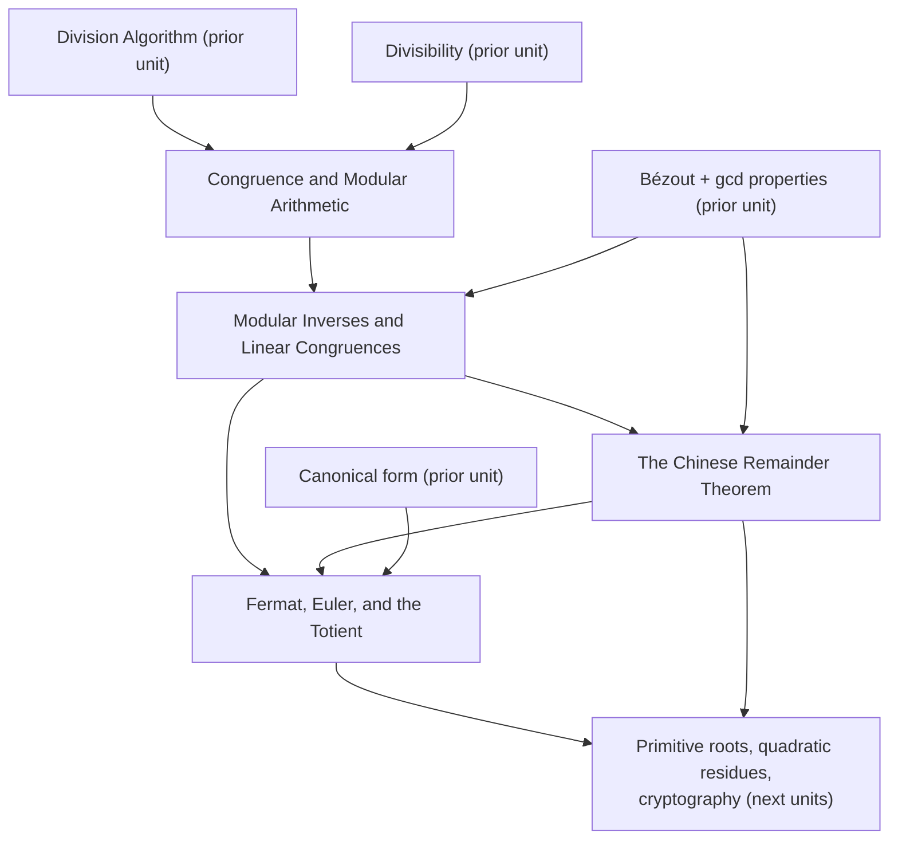

+++
title = "Modular Arithmetic"
+++

# Modular Arithmetic

The unit that turns "same remainder modulo $n$" into an arithmetic: the ring $\mathbb{Z}/n\mathbb{Z}$, when its elements can be inverted and equations solved, how systems of congruences with coprime moduli combine, and how large exponents collapse through Euler's and Fermat's theorems. Scope: from the congruence relation through the totient formula. It rests on the unique-factorization unit (division algorithm, Bézout, gcd properties, canonical form) and precedes primitive roots, quadratic residues, and the number-theoretic core of cryptography.

## Topic notes in reading order

#### [Congruence and Modular Arithmetic](Congruence%20and%20Modular%20Arithmetic/)

The relation $a \equiv b \pmod n$ ($n \mid a - b$), residue classes, and the commutative ring $\mathbb{Z}/n\mathbb{Z}$ with well-defined addition and multiplication.
#### [Modular Inverses and Linear Congruences](Modular%20Inverses%20and%20Linear%20Congruences/)

$[a]$ is a unit exactly when $\gcd(a,n) = 1$; $\mathbb{Z}/n\mathbb{Z}$ is a field exactly when $n$ is prime; $ax \equiv b \pmod n$ is solvable exactly when $\gcd(a,n) \mid b$, with $\gcd(a,n)$ solution classes.
#### [The Chinese Remainder Theorem](The%20Chinese%20Remainder%20Theorem/)

A system of congruences with pairwise coprime moduli has a unique solution modulo the product, with the explicit formula and the ring isomorphism $\mathbb{Z}/mn\mathbb{Z} \cong \mathbb{Z}/m\mathbb{Z} \times \mathbb{Z}/n\mathbb{Z}$.
#### [Fermat's Little Theorem, Euler's Theorem, and the Totient](Fermat%27s%20Little%20Theorem%2C%20Euler%27s%20Theorem%2C%20and%20the%20Totient/) 

$\varphi(n) = |(\mathbb{Z}/n\mathbb{Z})^\times|$, Euler's $a^{\varphi(n)} \equiv 1$, Fermat's $a^{p-1} \equiv 1$, the totient formula, and exponent reduction modulo $\varphi(n)$.

## Dependency map

