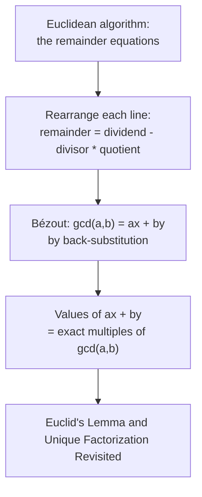

# Bézout's Identity

## Write the gcd as a combination of the two numbers

[The Euclidean Algorithm and the GCD](The%20Euclidean%20Algorithm%20and%20the%20GCD/) computes $\gcd(a,b)$ but does not yet express it in terms of $a$ and $b$. The goal here is the identity $\gcd(a,b) = ax + by$ for integers $x, y$, called Bézout coefficients. This identity is the real prize of the algorithm, because [Euclid's Lemma and Unique Factorization Revisited](Euclid%27s%20Lemma%20and%20Unique%20Factorization%20Revisited/) and the solvability of linear equations $ax + by = c$ both flow from it, not from the gcd value alone.

## Dependency map

Bézout is the equations of the algorithm read backward; the set characterization is its structural consequence.

## The rearrangement that drives everything

Each division line of the algorithm can be solved for its remainder:
$$\text{remainder} = \text{dividend} - \text{divisor} \cdot \text{quotient}. \tag{$\ast$}$$

`Why-this-form:` this writes each remainder as an integer combination of the two numbers directly above it in the algorithm. Repeated substitution climbs the ladder until only $a$ and $b$ remain.

## Back-substitution, concretely

On $\gcd(252, 105) = 21$, the algorithm gave $252 = 2 \cdot 105 + 42$, then $105 = 2 \cdot 42 + 21$, then $42 = 2 \cdot 21 + 0$. Solve the line holding the gcd for it, then eliminate the intermediate remainder $42$:
$$21 = 105 - 2 \cdot 42, \qquad 42 = 252 - 2 \cdot 105,$$
$$21 = 105 - 2(252 - 2 \cdot 105) = (-2)\cdot 252 + 5 \cdot 105.$$
Check: $(-2)(252) + 5(105) = -504 + 525 = 21$. So $x = -2$, $y = 5$, and one coefficient is negative, as expected.

`Type:` Bézout coefficients $x, y \in \mathbb{Z}$ may be negative; this is necessary, not a defect.

## The statement


**Theorem — Bézout's identity.**

For integers $a, b$ not both zero, there exist integers $x, y$ with
$$\gcd(a,b) = ax + by. \tag{1}$$


Skeleton. Prove by induction up the remainder ladder that every remainder is an integer combination of $a$ and $b$. The last nonzero remainder is the gcd, so it too is such a combination.

**Proof.**

> Set $r_{-1} := a$ and $r_0 := b$ for uniform indexing. The algorithm's rearranged line is
> $$r_i = r_{i-2} - q_i\, r_{i-1}. \tag{2}$$
>
> Base cases:
> $$a = a \cdot 1 + b \cdot 0, \qquad b = a \cdot 0 + b \cdot 1. \tag{3}$$
>
> Inductive step, assuming the two previous remainders are combinations of $a$ and $b$:
> $$r_{i-2} = a x_{i-2} + b y_{i-2}, \qquad r_{i-1} = a x_{i-1} + b y_{i-1} \tag{4}$$
> $$r_i = (a x_{i-2} + b y_{i-2}) - q_i (a x_{i-1} + b y_{i-1}) \tag{5}$$
> $$r_i = a\,(x_{i-2} - q_i x_{i-1}) + b\,(y_{i-2} - q_i y_{i-1}) \tag{6}$$
>
> `Algebra:` line $(2)$ is the rearrangement $(\ast)$, the only algebraic move.
>
> `Definition:` line $(3)$ anchors the induction: $a$ and $b$ are combinations of $a$ and $b$.
>
> `Assumption:` line $(4)$ is the inductive hypothesis on the two remainders one and two lines up.
>
> `Algebra:` line $(5)$ substitutes $(4)$ into $(2)$.
>
> `Algebra:` line $(6)$ regroups; the new coefficients are integers because they are built from integers by multiplication and subtraction (closure of $\mathbb{Z}$).
>
> By induction every remainder is a combination of $a$ and $b$. The last nonzero remainder is $\gcd(a,b)$ by [The Euclidean Algorithm and the GCD](The%20Euclidean%20Algorithm%20and%20the%20GCD/), so $\gcd(a,b) = ax + by$. $\blacksquare$

## The set of combinations equals the multiples of the gcd


**Theorem — Combination set.**

The set $\{ ax + by : x, y \in \mathbb{Z} \}$ is exactly the set of multiples of $\gcd(a,b)$.


**Proof.**

> `Property:` any common divisor of $a$ and $b$ divides every $ax + by$ by linearity, so $\gcd(a,b)$ divides every value; every combination is a multiple of the gcd.
>
> `Depends-on:` Bézout $(1)$ supplies the reverse: $\gcd(a,b)$ is itself a value, at the coefficients $x, y$ from $(1)$; scaling gives every multiple $m \cdot \gcd(a,b) = a(mx) + b(my)$. So the two sets coincide, and the smallest positive value of $ax + by$ is the gcd. $\blacksquare$

`Cross-domain:` this identifies $\{ax + by\}$ as the set of multiples of a single generator, the first instance of a principal ideal; the abstract version drives principal ideal domains in ring theory.

## Summary

`For:` Bézout turns the gcd from a number into a linear identity $\gcd(a,b) = ax + by$, which is what lets a prime coprime to $a$ be inverted and lets [Euclid's Lemma and Unique Factorization Revisited](Euclid%27s%20Lemma%20and%20Unique%20Factorization%20Revisited/) be proved.

`Assumes:` [The Euclidean Algorithm and the GCD](The%20Euclidean%20Algorithm%20and%20the%20GCD/) equations, run backward; closure of $\mathbb{Z}$ under multiplication and subtraction for the integer coefficients.

`Produces:` the identity $(1)$, and the characterization that the values of $ax + by$ are exactly the multiples of $\gcd(a,b)$.

`Pattern-match:` reach for Bézout whenever a linear equation $ax + by = c$ must be solved (solvable exactly when $\gcd(a,b) \mid c$), whenever a modular inverse is needed ($\gcd(a,m) = 1$ gives $ax + my = 1$, so $x$ inverts $a$ modulo $m$), or whenever a coprimality fact must be turned into an equation.
