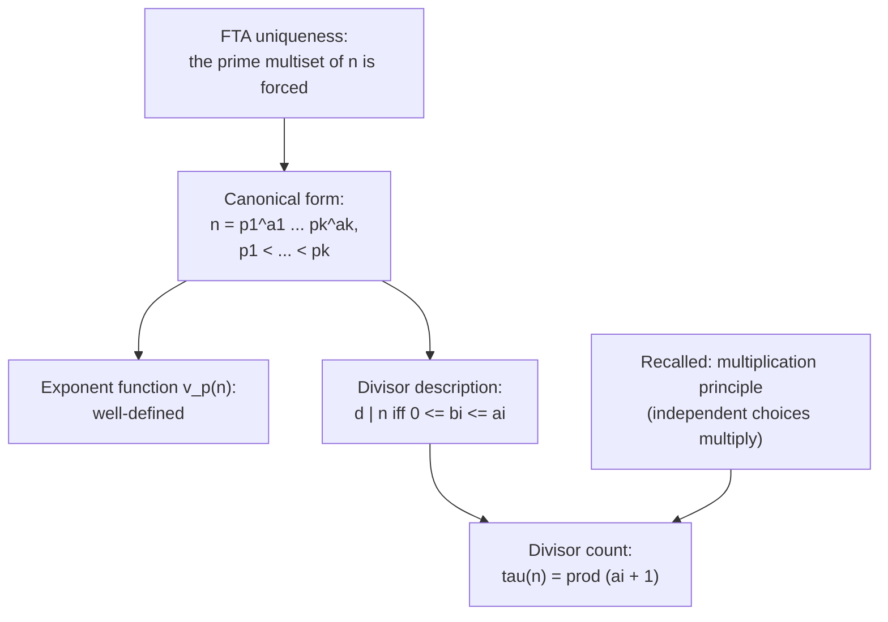

# Canonical Form and Divisor Structure

## One pinned written form so exponents become obvious

[Fundamental Theorem of Arithmetic](Fundamental%20Theorem%20of%20Arithmetic/) gives that the multiset of primes of $n$ is forced, but "up to order" still leaves many written forms of the same number, such as $2 \cdot 2 \cdot 3$, $2 \cdot 3 \cdot 2$, and $3 \cdot 2 \cdot 2$. To turn "the exponent of the prime $2$ in $n$" into one definite number that later arguments can name, a single pinned written form is needed. This note builds it and reads off two things it gives at once: which integers divide $n$, and how many do.

## Dependency map



Every result rests on FTA uniqueness; the divisor count additionally uses the multiplication principle.

## The canonical form

Concrete first. Group equal primes into powers and sort the distinct primes upward:
$$360 = 2^3\, 3^2\, 5, \qquad 12 = 2^2\, 3, \qquad 1000 = 2^3\, 5^3, \qquad 7 = 7^1.$$
Each number now has exactly one written form.


**Definition — Canonical form.**

The canonical form of an integer $n > 1$ is
$$n = p_1^{a_1} p_2^{a_2} \cdots p_k^{a_k}, \qquad p_1 < p_2 < \cdots < p_k \text{ distinct primes}, \quad a_i \ge 1. \tag{1}$$


`Type:` each $p_i$ is prime, each $a_i \in \mathbb{Z}_{\ge 1}$, and $n \in \mathbb{Z}_{>1}$.


**Theorem — Existence and uniqueness of the canonical form.**

Every $n > 1$ has exactly one canonical form.


**Proof.**

> `Depends-on:` [Fundamental Theorem of Arithmetic](Fundamental%20Theorem%20of%20Arithmetic/). Start from any prime factorization (existence), group equal primes into powers, and sort the distinct primes upward. The exponents count multiplicities in the prime multiset, which uniqueness forces, so the primes and exponents in $(1)$ are forced.


**Definition — The exponent function.**

For a prime $p$, $v_p(n)$ is the exponent of $p$ in the canonical form of $n$, and $v_p(n) = 0$ when $p$ is absent.


`Why-this-form:` $v_p(n)$ is well-defined precisely because the canonical form is unique. Example: $v_2(360) = 3$, $v_3(360) = 2$, $v_5(360) = 1$, $v_7(360) = 0$.

## Which integers divide $n$

Concrete first, on $12 = 2^2\, 3$. Take each prime to a power no higher than in $12$: powers of $2$ from $\{2^0, 2^1, 2^2\}$, powers of $3$ from $\{3^0, 3^1\}$. Every combination gives $1, 2, 4, 3, 6, 12$, exactly the divisors of $12$. Overspending fails: $2^3 = 8$ does not divide $12$, because $12$ holds only two $2$s.


**Theorem — Divisor description.**

The positive divisors of $n = p_1^{a_1} \cdots p_k^{a_k}$ are exactly
$$d = p_1^{b_1} p_2^{b_2} \cdots p_k^{b_k}, \qquad 0 \le b_i \le a_i \text{ for each } i. \tag{2}$$


Skeleton. Forward: given the exponent bounds, the complementary number $e = \prod p_i^{a_i - b_i}$ is a genuine integer, and $d\,e = n$, so $d \mid n$. Converse: given $d \mid n$, write $n = d e$, factor both into primes, concatenate, and apply uniqueness to force each prime of $d$ into the $p_i$ with exponent at most $a_i$. The load-bearing step is uniqueness on the concatenated factorization.

**Proof.**

> Forward direction.
> $$e = \prod_i p_i^{\,a_i - b_i} \tag{3}$$
> $$d\,e = \prod_i p_i^{b_i} \cdot \prod_i p_i^{a_i - b_i} = \prod_i p_i^{\,b_i + (a_i - b_i)} = \prod_i p_i^{a_i} = n \tag{4}$$
>
> `Definition:` line $(3)$ defines the complementary factor; each exponent $a_i - b_i \ge 0$ because $b_i \le a_i$, so $e \in \mathbb{Z}_{>0}$.
>
> `Algebra:` line $(4)$ adds exponents prime by prime via $p^x p^y = p^{x+y}$, then $b_i + (a_i - b_i) = a_i$, recovering the canonical form of $n$. So $n = d\,e$ with $e \in \mathbb{Z}$, which is $d \mid n$.
>
> Converse direction.
> $$d \mid n \implies n = d\,e, \quad e \in \mathbb{Z}_{>0} \tag{5}$$
> $$d = t_1 \cdots t_u, \quad e = w_1 \cdots w_v, \quad \text{all prime} \tag{6}$$
> $$n = t_1 \cdots t_u\, w_1 \cdots w_v \tag{7}$$
>
> `Definition:` line $(5)$ is the meaning of $d \mid n$.
>
> `Depends-on:` line $(6)$ applies existence to factor $d$ and $e$ into primes.
>
> `Algebra:` line $(7)$ substitutes into $n = d e$, concatenating the two prime lists.
>
> `Depends-on:` by [Fundamental Theorem of Arithmetic](Fundamental%20Theorem%20of%20Arithmetic/) uniqueness, the multiset in $(7)$ equals the canonical multiset of $n$, so every prime $t_j$ of $d$ is one of the $p_i$, and the count $b_i$ of copies of $p_i$ inside $d$ satisfies $0 \le b_i \le a_i$. Collecting $d$'s primes into powers gives the form $(2)$. $\blacksquare$
>
> `Type:` the one nontrivial fact spent is uniqueness at $(7)$; it forbids $d$ from carrying a prime outside the $p_i$ or an exponent above $a_i$.

## How many integers divide $n$

Concrete first. For $12 = 2^2\, 3$ the exponent of $2$ has $3$ choices $\{0,1,2\}$ and the exponent of $3$ has $2$ choices $\{0,1\}$, so $3 \times 2 = 6$ divisors. For $360 = 2^3\, 3^2\, 5$ the choices are $4, 3, 2$, so $4 \times 3 \times 2 = 24$.


**Theorem — Divisor count.**

Writing $\tau(n)$ for the number of positive divisors of $n = p_1^{a_1} \cdots p_k^{a_k}$,
$$\tau(n) = (a_1 + 1)(a_2 + 1) \cdots (a_k + 1). \tag{8}$$


**Proof.**

> `Depends-on:` the multiplication principle: an object built by $k$ independent choices offering $n_1, \dots, n_k$ options has $n_1 \cdots n_k$ forms.
>
> `Theorem:` by the divisor description $(2)$, each divisor is a tuple $(b_1, \dots, b_k)$ with $b_i \in \{0, 1, \dots, a_i\}$, which has $a_i + 1$ values. Distinct tuples give distinct divisors, because equal products would violate canonical uniqueness. So divisors correspond one-to-one with exponent tuples, and the count is $\prod_i (a_i + 1)$. $\blacksquare$

`Type:` uniqueness is spent once more, at "distinct tuples give distinct divisors"; without it two tuples could name one number and the count would overstate.

## Computation

Mechanism by hand: trial division. Test primes $2, 3, 5, \dots$ in order; each time one divides, divide it out fully and record its exponent; stop once the test prime exceeds $\sqrt{n}$; any remainder above $1$ is prime. On $84$: $84/2 = 42/2 = 21$ (exponent of $2$ is $2$), $21/3 = 7$ (exponent of $3$ is $1$), then $5^2 = 25 > 7$ so stop, and the remainder $7$ is prime, giving $84 = 2^2\, 3\, 7$.

```python
from math import isqrt


def factorize(n: int) -> dict[int, int]:
    """Return the canonical prime factorization of n > 1 as {prime: exponent}.

    Trial division up to the exact integer square-root bound. A composite n is
    caught by its smallest prime factor, which is at most sqrt(n), so testing
    candidates up to isqrt(n) is correct and sufficient.
    """
    factors: dict[int, int] = {}
    d = 2
    while d <= isqrt(n):          # exact integer bound; see Round-off tag below
        while n % d == 0:
            factors[d] = factors.get(d, 0) + 1
            n //= d
        d += 1
    if n > 1:                     # surviving remainder is prime
        factors[n] = factors.get(n, 0) + 1
    return factors
```

`Round-off:` computing the loop bound as `int(math.sqrt(n))` stores $\sqrt{n}$ as a nearby float and can land one below the true value for large $n$, missing a factor. `math.isqrt(n)` returns the exact integer floor, so it never misses.
`Conditioning:` the cost is about $\sqrt{n}$ divisions, worst when $n$ is a product of two large primes of similar size. This growth, not any arithmetic error, is the practical wall behind RSA.

## Summary

`For:` the canonical form gives $n$ a single written identity, which makes the exponent $v_p(n)$ a definite number and turns divisibility questions into exponent comparisons.

`Assumes:` [Fundamental Theorem of Arithmetic](Fundamental%20Theorem%20of%20Arithmetic/) uniqueness, spent at the uniqueness of the form, at the converse of the divisor description $(7)$, and at the injectivity of the tuple-to-divisor map in the count.

`Produces:` the canonical form $(1)$, the exponent function $v_p(n)$, the divisor description $(2)$ that $d \mid n$ iff $d$ uses the same primes with exponents no larger than $n$'s, and the divisor count $(8)$, $\tau(n) = \prod (a_i + 1)$.

`Pattern-match:` reach for the canonical form whenever a problem compares divisibility, counts divisors, or reasons about the exponent of a fixed prime; the rule $a \mid b \iff v_p(a) \le v_p(b)$ for all primes $p$ is the exponent-wise restatement of the divisor description.
