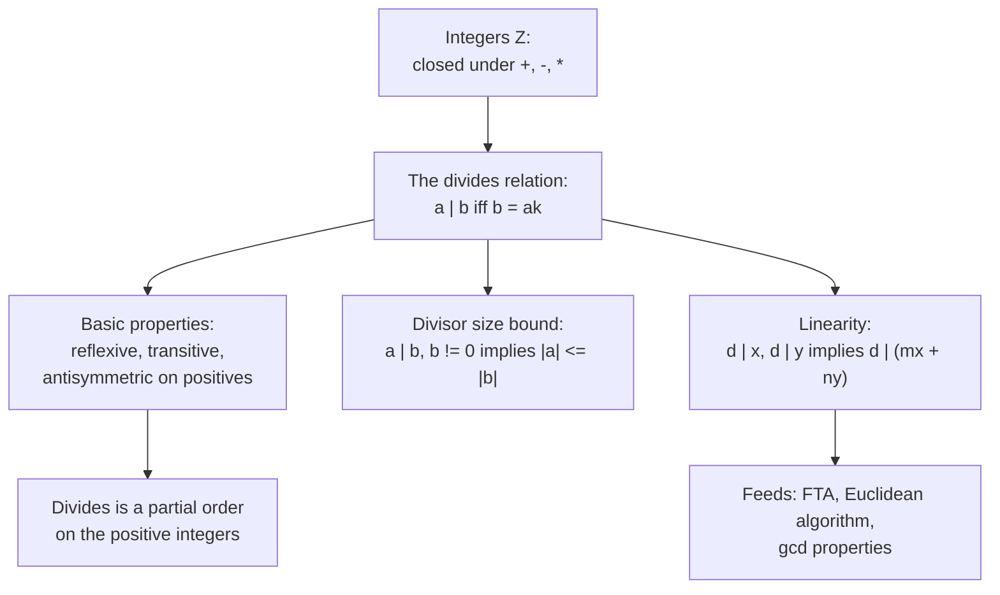

# Divisibility

## One relation underneath every later notion

Primes, the gcd, factorization, and the Euclidean algorithm are all stated in terms of a single relation: "$a$ divides $b$." Before any of them can be built, this relation and its arithmetic must be fixed rigorously, because every later proof spends one of the properties below. This note establishes the relation and the small set of facts used throughout the unit.

## Dependency map

## The divides relation

Concrete first. $3 \mid 12$ because $12 = 3 \cdot 4$, so the multiplier $k = 4$ exists. $5 \nmid 12$ because no integer $k$ gives $12 = 5k$.


**Definition — Divides.**

For integers $a, b$, the statement $a \mid b$ ("$a$ divides $b$") means there exists an integer $k$ with $b = ak$. The integer $a$ is then a divisor or factor of $b$, and $b$ is a multiple of $a$.


`Type:` $a, b, k \in \mathbb{Z}$.
`Why-this-form:` the definition uses only multiplication of integers, with no reference to fractions. "Divides evenly" is exactly the existence of a whole-number multiplier $k$.


**Distinction — The relation versus the quotient.**

$a \mid b$ is a relation that is either true or false. It is not the number $b / a$. The statement $2 \mid 6$ is true; it is not equal to the number $3$.



**Property — Edge cases with 0 and 1.**

Every integer divides $0$, because $0 = a \cdot 0$. The integer $1$ divides every integer, because $b = 1 \cdot b$. The integer $0$ divides only $0$, because $0 = 0 \cdot k$ forces the multiple to be $0$.


`Convention:` these three cases are stated separately on concrete values so no general rule silently mishandles them.

## Basic properties
  


**Property — Reflexive, transitive, antisymmetric.**

For integers $a, b, c$:
(i) $a \mid a$;
(ii) if $a \mid b$ and $b \mid c$ then $a \mid c$;
(iii) if $a \mid b$ and $b \mid a$ with $a, b > 0$, then $a = b$.


**Proof.**

> `Definition:` (i) holds since $a = a \cdot 1$.
> `Algebra:` (ii) from $b = ak$ and $c = b\ell$ gives $c = a(k\ell)$ with $k\ell \in \mathbb{Z}$, so $a \mid c$. Concrete: $2 \mid 6$ and $6 \mid 30$, and indeed $2 \mid 30$.
> `Theorem:` (iii) from $b = ak$ and $a = b\ell$ gives $a = a k \ell$, so $k\ell = 1$ by cancellation; with $a, b > 0$ the multipliers are positive, so $k = \ell = 1$ and $a = b$.

## The divisor size bound

Concrete first. $4 \mid 12$ and $|4| \le |12|$. A positive divisor cannot exceed the number it divides, unless the number is $0$.


**Theorem — Divisor size bound.**

If $a \mid b$ and $b \neq 0$, then $|a| \le |b|$.


**Proof.**

> `Algebra:` $b = ak$ with $b \neq 0$ forces $k \neq 0$, so $|k| \ge 1$; then $|b| = |a|\,|k| \ge |a|$.

`Type:` this bound is what makes the set of positive divisors of a nonzero integer finite, which is why $\gcd(a,b)$ (a largest divisor) exists at all.

## Linearity

This is the property used most often in the unit, so it is stated on its own and anchored on numbers.

Concrete first. $3 \mid 12$ and $3 \mid 6$, so $3 \mid (12 - 6) = 6$ and $3 \mid (12 + 6) = 18$. A common divisor of two numbers divides their sum and their difference.


**Property — Linearity of divisibility.**

If $d \mid x$ and $d \mid y$, then $d \mid (mx + ny)$ for all integers $m, n$.


**Proof.**

> `Algebra:` from $x = ds$ and $y = dt$, $mx + ny = d(ms + nt)$ with $ms + nt \in \mathbb{Z}$, so $d \mid (mx + ny)$.

`Type:` the special cases $m = n = 1$ (the sum) and $m = 1, n = -1$ (the difference) are the ones spent in the remainder-swap lemma of [The Euclidean Algorithm and the GCD](The%20Euclidean%20Algorithm%20and%20the%20GCD/) and in the uniqueness proof of [Fundamental Theorem of Arithmetic](Fundamental%20Theorem%20of%20Arithmetic/).

## Divisibility as a partial order

`POV:` on the positive integers, the divides relation is a partial order, because it is reflexive, antisymmetric, and transitive by the properties above. The number $1$ sits at the bottom, dividing everything. The primes sit directly above $1$, because a prime's only positive divisors are $1$ and itself, so nothing lies strictly between $1$ and a prime. This ordering is the structural picture behind prime factorization: every positive integer is reached from the atoms just above $1$.

## Summary

`For:` divisibility is the one relation every later topic is written in; this note fixes its definition and the handful of properties that later proofs spend.

`Assumes:` only the integers and their closure under addition, subtraction, and multiplication. No well-ordering is needed here; it enters later, in [The Division Algorithm](The%20Division%20Algorithm/).

`Produces:` the definition $a \mid b \iff b = ak$; the edge cases for $0$ and $1$; reflexivity, transitivity, antisymmetry; the divisor size bound (which makes the gcd exist); and linearity, the workhorse of the unit.

`Pattern-match:` reach for linearity whenever two quantities share a common divisor and a third is built from them by addition or subtraction; reach for the size bound whenever a largest divisor must be shown to exist; and read the divides relation as a partial order whenever the structure of factorization is in view.
