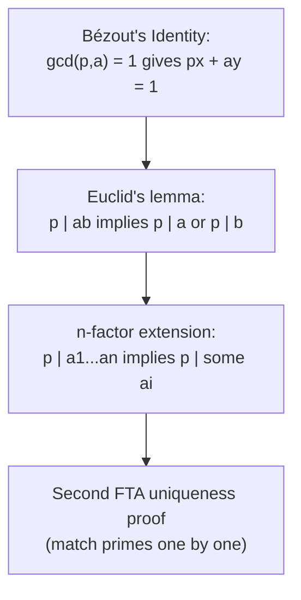

# Euclid's Lemma and Unique Factorization Revisited

## The need — discharge the debt left by FTA uniqueness

The uniqueness proof in [Fundamental Theorem of Arithmetic](Fundamental%20Theorem%20of%20Arithmetic/) deliberately avoided Euclid's lemma, because that lemma needs [Bézout's Identity](Be%CC%81zout%27s%20Identity/), which had not been built. Bézout now exists, so the lemma is available. This note proves Euclid's lemma from Bézout, extends it to any finite product, and uses it to re-prove FTA uniqueness by the shorter standard route, paying the deferred debt.

## Dependency map

Euclid's lemma is Bézout spent once; the extension is an induction; the second uniqueness proof is the payoff.

## The objects this note spends


**Property — Prime dichotomy.**

For a prime $p$ and any integer $a$, either $p \mid a$ or $\gcd(p, a) = 1$.


**Proof.**

> `Depends-on:` $\gcd(p, a)$ divides $p$, and a prime has only the divisors $1$ and $p$; so the gcd is $p$ (giving $p \mid a$) or $1$ (giving coprimality). There is no third case.

## Euclid's lemma

Concrete first. With $p = 5$ and $ab = 6 \cdot 35 = 210$: since $5 \mid 210$, the lemma says $5$ divides a factor, and indeed $5 \nmid 6$ while $5 \mid 35$. Contrast a composite divisor: $6 \mid 36 = 4 \cdot 9$, yet $6 \nmid 4$ and $6 \nmid 9$. The lemma fails for composite divisors, which is why it is stated for primes.


**Theorem — Euclid's lemma.**

Let $p$ be prime and $a, b \in \mathbb{Z}$. If $p \mid ab$, then $p \mid a$ or $p \mid b$. $\tag{1}$


Skeleton. Assume $p \mid ab$ and $p \nmid a$; show $p \mid b$. Coprimality of $p$ and $a$ gives a Bézout identity equal to $1$; multiply by $b$ and read that both resulting terms carry $p$.

**Proof.**

> $$\gcd(p, a) = 1 \tag{2}$$
> $$1 = p x + a y, \qquad x, y \in \mathbb{Z} \tag{3}$$
> $$b = p x b + a b y \tag{4}$$
> $$p \mid b \tag{5}$$
>
> `Property:` line $(2)$ uses the prime dichotomy: $p \nmid a$ and $p$ prime force $\gcd(p, a) = 1$.
> `Depends-on:` line $(3)$ is [Bézout's Identity](Be%CC%81zout%27s%20Identity/) applied to the coprime pair $p, a$.
> `Algebra:` line $(4)$ multiplies $(3)$ by $b$.
> `Property:` line $(5)$ reads $(4)$: the term $pxb$ carries $p$, and the term $aby$ carries $p$ because $p \mid ab$ gives $p \mid (ab)y$; by linearity their sum $b$ is divisible by $p$. $\blacksquare$
>
> `Type:` the single nontrivial fact spent is Bézout, at line $(3)$.

## Extension to several factors


**Theorem — Euclid's lemma for products.**

If $p \mid a_1 a_2 \cdots a_n$ for a prime $p$, then $p \mid a_i$ for at least one $i$. $\tag{6}$


**Proof.**

> `Theorem:` induction on $n$. Base $n = 1$ is immediate. For the step, group $a_1 \cdots a_n = (a_1 \cdots a_{n-1}) \cdot a_n$ and apply $(1)$: either $p \mid a_n$, done, or $p \mid a_1 \cdots a_{n-1}$, and the inductive hypothesis gives $p \mid a_i$ for some $i \le n - 1$. $\blacksquare$

## The second uniqueness proof


**Theorem — FTA uniqueness, standard route.**

If $p_1 \cdots p_r = q_1 \cdots q_s$ with all factors prime, the two lists agree up to order.


**Proof.**

> `Depends-on:` $p_1$ divides the left side, so it divides $q_1 \cdots q_s$; by the product lemma $(6)$, $p_1 \mid q_j$ for some $j$. Since $q_j$ is prime, $p_1 = q_j$. Cancel this common prime from both sides, leaving a shorter equation of the same form, and repeat. Each step matches one $p$ to one $q$. The process ends only when both sides empty together, because a side reaching $1$ while the other still holds a prime above $1$ would make the sides unequal. So $r = s$ and the primes match in pairs. $\blacksquare$

`Type:` the step "$p_1 \mid q_1 \cdots q_s$ forces $p_1 = q_j$" is exactly what Euclid's lemma supplies; the longer smallest-counterexample construction in [Fundamental Theorem of Arithmetic](Fundamental%20Theorem%20of%20Arithmetic/) reached the same conclusion without it, which is why that route existed before this one.

## Summary

`For:` Euclid's lemma states that a prime dividing a product divides a factor, and it discharges the deferred FTA uniqueness debt with a short second proof.

`Assumes:` [Bézout's Identity](Be%CC%81zout%27s%20Identity/), spent once at line $(3)$; induction for the product extension.

`Produces:` Euclid's lemma $(1)$, its $n$-factor extension $(6)$, and the standard proof of FTA uniqueness.

`Pattern-match:` recognize Euclid's lemma behind every argument that "a prime in a product must sit in a factor," including the existence of modular inverses and the standard route to unique factorization; recognize its failure for composite divisors as the reason the lemma is a statement about primes specifically.
