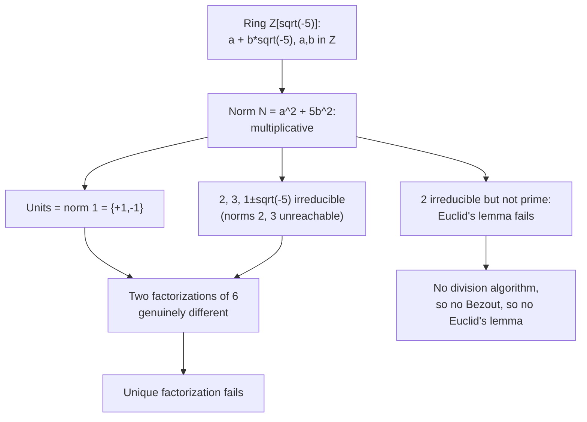

# Failure of Unique Factorization in Z[sqrt(-5)]

## Uniqueness is special to Z, not universal

[Fundamental Theorem of Arithmetic](Fundamental%20Theorem%20of%20Arithmetic/) proved uniqueness for $\mathbb{Z}$, and its summary claimed uniqueness is glued to $\mathbb{Z}$. That claim is empty until a concrete ring is exhibited where factorization into irreducibles is not unique. This note builds that ring, proves the failure with the norm as its only tool, and pinpoints the exact property of $\mathbb{Z}$ that breaks.

## Dependency map

## The general-ring vocabulary, recalled


**Definition — Integral domain, unit, divides.**

An integral domain is a commutative ring with $1 \neq 0$ and no zero divisors ($\alpha\beta = 0$ forces $\alpha = 0$ or $\beta = 0$). $\alpha \mid \beta$ means $\beta = \alpha\gamma$ for a ring element $\gamma$. A unit has a multiplicative inverse in the ring.


`Depends-on:` this generalizes [Divisibility](Divisibility/) from $\mathbb{Z}$ to an arbitrary ring. In a domain, cancellation holds: $\alpha\gamma = \beta\gamma$ with $\gamma \neq 0$ gives $\alpha = \beta$.
`Type:` in $\mathbb{Z}$ our definition of a prime number (only divisors $1$ and itself) was an irreducibility condition, and [Euclid's Lemma and Unique Factorization Revisited](Euclid%27s%20Lemma%20and%20Unique%20Factorization%20Revisited/) upgraded it to the prime property. This note is about a ring where those two conditions come apart.

## The ring Z[sqrt(-5)]

Concrete first. $\sqrt{-5}$ is the complex number squaring to $-5$. Sample elements: $3$, $1 + \sqrt{-5}$, $2 - 3\sqrt{-5}$. A product: $(1+\sqrt{-5})(1-\sqrt{-5}) = 1 - (-5) = 6$.


**Definition — The ring.**

$$\mathbb{Z}[\sqrt{-5}] = \{\, a + b\sqrt{-5} : a, b \in \mathbb{Z} \,\}. \tag{1}$$


$$(a + b\sqrt{-5})(c + d\sqrt{-5}) = (ac - 5bd) + (ad + bc)\sqrt{-5} \tag{2}$$

`Algebra:` line $(2)$ uses $(\sqrt{-5})^2 = -5$; the outputs are integers, so the set is closed under multiplication and is a commutative ring.
`Type:` it is a subset of $\mathbb{C}$, which has no zero divisors, so $\mathbb{Z}[\sqrt{-5}]$ is an integral domain and cancellation is available.

## The norm

The norm is the one tool of this note. It sends questions about $\mathbb{Z}[\sqrt{-5}]$ to questions about ordinary integers.

Concrete first. $N(3) = 9$, $N(1 + \sqrt{-5}) = 1 + 5 = 6$, $N(2 - 3\sqrt{-5}) = 4 + 45 = 49$.


**Definition — Norm.**

$$N(a + b\sqrt{-5}) = a^2 + 5b^2 = \alpha\bar\alpha = |\alpha|^2, \tag{3}$$
where $\bar\alpha = a - b\sqrt{-5}$ is the complex conjugate.



**Property — Norm properties.**

(1) $N(\alpha)$ is a nonnegative integer, zero only when $\alpha = 0$.
(2) Multiplicative: $N(\alpha\beta) = N(\alpha)N(\beta)$.
(3) If $\alpha \mid \beta$ then $N(\alpha) \mid N(\beta)$ in $\mathbb{Z}$.


**Proof.**

> `Algebra:` (2) from $N(\alpha) = \alpha\bar\alpha$ and $\overline{\alpha\beta} = \bar\alpha\bar\beta$: $N(\alpha\beta) = \alpha\beta\bar\alpha\bar\beta = N(\alpha)N(\beta)$. Direct check: $(ac-5bd)^2 + 5(ad+bc)^2 = (a^2+5b^2)(c^2+5d^2)$.
> `Depends-on:` (3) from $\beta = \alpha\gamma$ gives $N(\beta) = N(\alpha)N(\gamma)$, and $N(\gamma) \in \mathbb{Z}$. This turns ring divisibility into integer divisibility.

## The units are exactly ±1


**Theorem — Units.**

$$ alpha\ is\ a\ unit\ if\ and\ only\ if\ N(\alpha) = 1, and\ the\ only\ units\ are \pm 1. \tag{4}$$


**Proof.**

> `Depends-on:` if $\alpha\beta = 1$ then $N(\alpha)N(\beta) = 1$ with positive integer norms, so $N(\alpha) = 1$. Conversely $N(\alpha) = 1$ means $\alpha\bar\alpha = 1$ with $\bar\alpha$ in the ring, so $\alpha$ is a unit.
>
> `Algebra:` $a^2 + 5b^2 = 1$ forces $b = 0$ (else $\ge 5$) and $a = \pm 1$, so the units are $\pm 1$.

`Type:` "the same factorization" is judged up to units, so here only up to a factor of $\pm 1$, exactly as in $\mathbb{Z}$.

## Irreducible versus prime


**Definition — Irreducible and prime elements.**

A nonzero non-unit $\pi$ is irreducible if $\pi = \alpha\beta$ forces $\alpha$ or $\beta$ to be a unit. It is prime if $\pi \mid \alpha\beta$ forces $\pi \mid \alpha$ or $\pi \mid \beta$.



**Theorem — Prime implies irreducible.**

In an integral domain, every prime element is irreducible.


**Proof.**

> `Theorem:` if $\pi$ is prime and $\pi = \alpha\beta$, then $\pi \mid \alpha\beta$, so $\pi \mid \alpha$ (say), $\alpha = \pi\gamma$, giving $\pi = \pi\gamma\beta$; cancel $\pi$ to get $1 = \gamma\beta$, so $\beta$ is a unit. $\blacksquare$

`Type:` the reverse, irreducible implies prime, holds in $\mathbb{Z}$ (that was Euclid's lemma) and in every unique factorization domain, but not in general. This ring is where it fails.

## The two factorizations of 6, and irreducibility

$$6 = 2 \cdot 3 = (1 + \sqrt{-5})(1 - \sqrt{-5}) \tag{5}$$
$$N(2) = 4, \quad N(3) = 9, \quad N(1 \pm \sqrt{-5}) = 6 \tag{6}$$

The engine: $a^2 + 5b^2 = 2$ and $= 3$ have no integer solutions, because $b = 0$ forces $a^2 \in \{2,3\}$ (impossible) and $|b| \ge 1$ forces the value $\ge 5$. So no element has norm $2$ or $3$.


**Theorem — The four factors are irreducible.**

$2$, $3$, $1 + \sqrt{-5}$, and $1 - \sqrt{-5}$ are each irreducible in $\mathbb{Z}[\sqrt{-5}]$.


**Proof.**

> `Depends-on:` if $2 = \alpha\beta$ with non-units, $N(\alpha)N(\beta) = 4$ with each $> 1$, so both are $2$; no element has norm $2$, contradiction. For $3$, both would be $3$; impossible. For $1 \pm \sqrt{-5}$, $N(\alpha)N(\beta) = 6$ with each $> 1$ forces $\{N(\alpha),N(\beta)\} = \{2,3\}$; both impossible. $\blacksquare$

## The two factorizations are genuinely different


**Theorem — Inequivalent factorizations.**

The lists $\{2, 3\}$ and $\{1+\sqrt{-5}, 1-\sqrt{-5}\}$ are not the same up to order and units.


**Proof.**

> `Depends-on:` two elements are associates when one is a unit times the other; by $(4)$ the units are $\pm 1$, so associates have equal norm. From $(6)$, $N(2) = 4$ and $N(3) = 9$, while $N(1 \pm \sqrt{-5}) = 6$; since $4 \neq 6$ and $9 \neq 6$, neither $2$ nor $3$ is an associate of $1 \pm \sqrt{-5}$. So the two factorizations of $6$ are genuinely different, and unique factorization fails. $\blacksquare$

## The deep reason: irreducible but not prime


**Theorem — 2 is irreducible but not prime.**

$$2 \mid 6 = (1+\sqrt{-5})(1-\sqrt{-5}), \qquad 2 \nmid (1+\sqrt{-5}), \qquad 2 \nmid (1-\sqrt{-5}). \tag{7}$$


**Proof.**

> `Depends-on:` if $2 \mid (1+\sqrt{-5})$, then by norm divisibility $N(2) = 4$ divides $N(1+\sqrt{-5}) = 6$; but $4 \nmid 6$. Same for $1 - \sqrt{-5}$. So $2$ divides the product but neither factor: Euclid's lemma fails. $\blacksquare$

`Cross-domain:` why the lemma fails here but held in $\mathbb{Z}$. In $\mathbb{Z}$ we proved it along a chain: [The Division Algorithm](The%20Division%20Algorithm/) gave remainders, [The Euclidean Algorithm and the GCD](The%20Euclidean%20Algorithm%20and%20the%20GCD/) gave the gcd, [Bézout's Identity](Be%CC%81zout%27s%20Identity/) followed, and [Euclid's Lemma and Unique Factorization Revisited](Euclid%27s%20Lemma%20and%20Unique%20Factorization%20Revisited/) followed from Bézout. Every link needed the division algorithm's strictly smaller remainder. $\mathbb{Z}[\sqrt{-5}]$ has no such division algorithm, so it is not a Euclidean domain, there is no Bézout identity, and Euclid's lemma is unavailable. The exact machinery that made $\mathbb{Z}$ special is absent, and unique factorization goes with it. This is the glued assumption from the FTA note made concrete: the first thing that breaks off $\mathbb{Z}$ is irreducible implies prime.

## Summary

`For:` this proves unique factorization is a theorem about $\mathbb{Z}$ and unique factorization domains, not a universal fact, by exhibiting $6$ with two genuinely different irreducible factorizations.

`Assumes:` multiplicativity of the norm $N(a+b\sqrt{-5}) = a^2 + 5b^2$, spent at every irreducibility and non-divisibility step, and the fact that $2$ and $3$ are not norm values.

`Produces:` the norm and its properties; the units $\pm 1$; irreducibility of $2, 3, 1 \pm \sqrt{-5}$; the inequivalence of the two factorizations; and the diagnosis irreducible-not-prime, which is Euclid's lemma failing for want of a division algorithm.

`Pattern-match:` whenever unique factorization is invoked, first check the ring is a UFD, because the property is not automatic; in a quadratic ring the norm decides irreducibility and settles whether two factorizations agree; and remember that the whole division-algorithm-to-Bézout-to-Euclid chain is precisely what a ring must have for factorization to be unique. The fix, unique factorization of ideals in a Dedekind domain, is a forward door to algebraic number theory.
