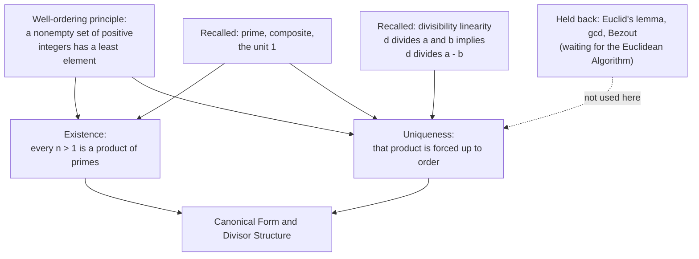

# Fundamental Theorem of Arithmetic

## Are primes the forced parts of every integer?

The question has two halves, easy to run together, so they are separated at the start. The first half asks whether the primes are the pieces that every integer factors into. The second half asks whether that factorization is forced, meaning it is the only one possible up to the order of the factors.

The phenomenon shown on one number first. Factor $360$ by two different opening splits.

$$360 = 4 \cdot 90 = (2 \cdot 2)(9 \cdot 10) = (2 \cdot 2)(3 \cdot 3)(2 \cdot 5) = 2^3\, 3^2\, 5 \tag{1}$$

$$360 = 8 \cdot 45 = (2 \cdot 2 \cdot 2)(5 \cdot 9) = (2^3)(5)(3^2) = 2^3\, 3^2\, 5 \tag{2}$$

The two routes start from different splits, $4 \cdot 90$ against $8 \cdot 45$, yet they end at the same list of primes with the same multiplicities: three $2$s, two $3$s, one $5$. The theorem proves that agreement is forced for every integer, not a feature of the number $360$.

Two independent claims hide here. Existence can hold while uniqueness fails; in the larger number system $\mathbb{Z}[\sqrt{-5}]$ factorizations exist but are not unique. So the theorem must prove each half separately.

## Dependency map

Both proofs run on one engine, the well-ordering principle, as smallest-counterexample arguments. Divisibility linearity feeds only uniqueness. The dashed node marks the tools deliberately not spent here; see [Euclid's Lemma and Unique Factorization Revisited](Euclid%27s%20Lemma%20and%20Unique%20Factorization%20Revisited/) for the shorter proof they enable.

## The objects the theorem is stated in


**Definition — Prime, composite, unit.**

An integer $p > 1$ is **prime** when its only positive divisors are $1$ and $p$. An integer $n > 1$ is **composite** when it is not prime, so $n = ab$ with $1 < a < n$ and $1 < b < n$. The number $1$ is a **unit**: it divides $1$, so it is neither prime nor composite.


`Type:` each of $p, n, a, b \in \mathbb{Z}$.
`Convention:` composite is the exact negation of prime among integers above $1$, so every $n > 1$ is prime or composite with no third case.


**Property — Divisibility and its linearity.**

$a \mid b$ means there is $k \in \mathbb{Z}$ with $b = ak$. If $d \mid x$ and $d \mid y$ then $d \mid (mx + ny)$ for all $m, n \in \mathbb{Z}$.


**Proof.**

> `Depends-on:` [Divisibility](Divisibility/) develops the relation $a \mid b$ and its linearity; the linearity used here is immediate from $x = ds$, $y = dt$, so $mx + ny = d(ms + nt)$.

## The statement


**Theorem — Existence of a prime factorization.**

Every integer $n > 1$ can be written as a product of primes.

`Convention:` if $n$ is itself prime, such as $n = 7$, the product has a single factor. A product of primes is allowed to have length one.


**Theorem — Uniqueness up to order.**

 If $n = p_1 p_2 \cdots p_r$ and $n = q_1 q_2 \cdots q_s$ with all $p_i, q_j$ prime, then $r = s$, and after reordering, $p_i = q_i$ for every $i$.

> `Why-this-form:` "up to order" means two factorizations count as the same when one is a rearrangement of the other, because multiplication is commutative and associative, so the value does not depend on the order. The clean statement is that the multiset of prime factors is forced. A multiset records how many times each prime appears but carries no order, so $\{2,2,3\}$ and $\{3,2,2\}$ are the same multiset.

## Existence

The descent on a single number first. Factor $90$: it is composite, so $90 = 9 \cdot 10$; neither factor is prime, so $9 = 3 \cdot 3$ and $10 = 2 \cdot 5$; every factor is now prime, so $90 = 2 \cdot 3^2 \cdot 5$. Each split replaces a composite by two strictly smaller factors above $1$, and a strictly decreasing sequence of integers above $1$ cannot continue forever. The general proof replaces "cannot descend forever" with the well-ordering principle.

Skeleton. Collect every integer above $1$ with no prime factorization into a set $C$. If $C$ is nonempty, take its least element $n$. Show $n$ is not prime (a prime is its own length-one factorization) and not composite (a composite splits into two factors below $n$, which then factor, so their product factors $n$). No case survives, so $C$ is empty. The load-bearing step is the minimality of $n$: every integer below the least failure is not a failure.

**Proof.**

> $$C = \{\, n \in \mathbb{Z} : n > 1 \text{ and } n \text{ is not a product of primes} \,\} \tag{3}$$
>
> $$\text{Assume } C \neq \varnothing, \qquad n = \text{least element of } C \tag{4}$$
>
> $$\text{for every } m \text{ with } 1 < m < n, \quad m \text{ is a product of primes} \tag{5}$$
>
> Case A, $n$ prime:
> $$n = n \text{ is a product of primes of length one} \tag{6}$$
>
> Case B, $n$ composite:
> $$n = ab, \quad 1 < a < n, \quad 1 < b < n \tag{7}$$
> $$a = p_1 \cdots p_j, \quad b = p_{j+1} \cdots p_k, \quad \text{all prime} \tag{8}$$
> $$n = ab = p_1 \cdots p_j\, p_{j+1} \cdots p_k \tag{9}$$
>
> `Definition:` line $(3)$ collects all counterexamples; each is a positive integer above $1$.
>
> `Depends-on:` line $(4)$ spends the well-ordering principle: a nonempty set of positive integers has a least element.
>
> `Theorem:` line $(5)$ reads "least": no integer strictly between $1$ and $n$ lies in $C$, so by $(3)$ each is a product of primes.
>
> `Convention:` line $(6)$ uses the length-one convention, so a prime $n$ is a product of primes, contradicting $n \in C$.
>
> `Definition:` line $(7)$ uses that a non-prime $n > 1$ is composite, giving two factors strictly between $1$ and $n$.
>
> `Theorem:` line $(8)$ applies $(5)$ to $a$ and $b$, since both lie in $(1, n)$.
>
> `Algebra:` line $(9)$ concatenates the two prime lists; a product of primes results, contradicting $n \in C$.
>
> Both cases contradict $n \in C$, and the two cases are exhaustive. So $C = \varnothing$, and every integer $n > 1$ is a product of primes. $\blacksquare$
>
> `POV:` the same argument reads as strong induction, since well-ordering and strong induction on the positive integers are equivalent. The inductive hypothesis "every $m$ with $1 < m < n$ already factors" plays the exact role of line $(5)$.

## Uniqueness

No concrete counterexample can be run, because the integers do have unique factorization, so there is no genuine bad $n$ to walk through. The two load-bearing pieces are anchored on numbers instead. The distributive rewrite: with $q_1 = 7, p_1 = 5, q_2 = 3$, both $(7-5)\cdot 3 = 6$ and $7\cdot 3 - 5\cdot 3 = 6$ agree, which is $(q_1 - p_1)q_2 = q_1 q_2 - p_1 q_2$. The closing linearity: with $d = 3$, since $3 \mid 12$ and $3 \mid 6$, also $3 \mid (12 - 6)$.

Skeleton. Assume some integer has two multiset-different factorizations; take the least such $n$. Let $p_1$ be the smallest prime in either list; a cancellation step shows $p_1$ is absent from the $q$-list, so $p_1 < q_1$. Build $N = (q_1 - p_1)\, q_2 \cdots q_s$, a positive integer with $1 < N < n$, so $N$ factors uniquely. One reading gives $p_1 \mid N$; the unique factorization of $N$ then forces $p_1 \mid (q_1 - p_1)$; linearity gives $p_1 \mid q_1$; primality gives $p_1 = q_1$, contradicting $p_1 < q_1$. The load-bearing step is the construction of $N$ and reading it two ways, because $N < n$ is exactly what makes its factorization unique.

**Proof.**

> $$C = \{\, n \in \mathbb{Z} : n > 1 \text{ and } n \text{ has two prime factorizations differing as multisets} \,\} \tag{10}$$
> $$\text{Assume } C \neq \varnothing, \qquad n = \text{least element of } C \tag{11}$$
> $$\text{every } m \text{ with } 1 < m < n \text{ factors uniquely} \tag{12}$$
> $$n = p_1 \cdots p_r = q_1 \cdots q_s, \qquad p_1 \le \cdots \le p_r, \ \ q_1 \le \cdots \le q_s \tag{13}$$
> $$p_1 \text{ is the smallest prime in either list, placed in the } p\text{-list; then } p_1 < q_1 \le q_j \tag{14}$$
> $$N = (q_1 - p_1)\, q_2 q_3 \cdots q_s \tag{15}$$
> $$N = q_1 q_2 \cdots q_s - p_1 q_2 \cdots q_s = n - p_1 q_2 \cdots q_s \tag{16}$$
> $$N = p_1 p_2 \cdots p_r - p_1 q_2 \cdots q_s = p_1\,(p_2 \cdots p_r - q_2 \cdots q_s) \tag{17}$$
> $$1 < N < n \tag{18}$$
> $$p_1 \mid N \tag{19}$$
> $$p_1 \mid (q_1 - p_1) \tag{20}$$
> $$p_1 \mid \big[(q_1 - p_1) + p_1\big] = q_1 \tag{21}$$
> $$p_1 = q_1 \tag{22}$$
>
> `Definition:` line $(10)$ collects integers with two factorizations differing in some prime's multiplicity, not merely in order.
>
> `Depends-on:` line $(11)$ spends well-ordering to take the least counterexample.
>
> `Theorem:` line $(12)$ is minimality: nothing below $n$ is a counterexample, and by existence each such $m$ has exactly one factorization.
>
> `Assumption:` line $(13)$ records the two factorizations from $n \in C$, sorted so size-indexing is available.
>
> `Theorem:` line $(14)$ has a cancellation sub-argument. If $p_1$ occurred in the $q$-list, divide both factorizations by $p_1$ to get two factorizations of $n/p_1$, which lies in $(1, n)$, so by $(12)$ they match; restoring $p_1$ makes the original lists match, contradicting $n \in C$. So $p_1$ is absent from the $q$-list, and being smallest overall gives $p_1 < q_1$.
>
> `Definition:` line $(15)$ builds the auxiliary integer; $q_1 - p_1 \ge 1$ by $(14)$ and $q_2 \cdots q_s$ is nonempty since $s \ge 2$.
>
> `Algebra:` line $(16)$ is the distributive law, and the first term is $n$ by $(13)$.
> `Algebra:` line $(17)$ substitutes the other expression $n = p_1 \cdots p_r$ and factors out $p_1$.
>
> `Theorem:` line $(18)$ bounds $N$: $N \ge q_2 \ge 2$ gives $N > 1$, and $q_1 - p_1 < q_1$ gives $N < n$, so by $(12)$ the integer $N$ factors uniquely.
>
> `Depends-on:` line $(19)$ reads $(17)$: $N = p_1 \cdot (\text{integer})$, so $p_1 \mid N$, and $p_1$ appears in the unique factorization of $N$.
>
> `Theorem:` line $(20)$ uses $(15)$ with uniqueness of $N$: the factorization of $N$ is built from the primes of $q_1 - p_1$ together with $q_2, \dots, q_s$; by $(14)$, $p_1$ is not any $q_j$, so $p_1$ must divide $q_1 - p_1$.
>
> `Property:` line $(21)$ applies linearity to $p_1 \mid (q_1 - p_1)$ and $p_1 \mid p_1$, and the sum is $q_1$.
>
> `Definition:` line $(22)$ uses that a prime $q_1$ has only divisors $1$ and $q_1$, and $p_1 > 1$, so $p_1 = q_1$.
>
> Line $(22)$ contradicts $p_1 < q_1$ from $(14)$. So $C = \varnothing$: no integer above $1$ has two factorizations differing as multisets. With existence, every integer above $1$ has exactly one prime factorization up to order. $\blacksquare$

## Summary

`For:` the theorem makes "the prime factorization of $n$" a single well-defined object, which is what lets [Canonical Form and Divisor Structure](Canonical%20Form%20and%20Divisor%20Structure/) define the exponent of a prime in $n$ as a definite number.

`Assumes:` one engine, the well-ordering principle, spent at line $(4)$ for existence and line $(11)$ for uniqueness through the minimality readings $(5)$ and $(12)$. Uniqueness additionally spends divisibility linearity at line $(21)$.

`Produces:` existence of a prime factorization, and its uniqueness up to order, with the whole force of uniqueness concentrated in the construction of $N$ at $(15)$ and its two readings at $(19)$ and $(20)$.

`Pattern-match:` recognize this theorem behind any argument that names "the exponent of a prime in $n$" or "the factorization of $n$": exponent-parity proofs such as the irrationality of $\sqrt{2}$, divisor counting, and the fact that unique factorization can fail in a larger ring such as $\mathbb{Z}[\sqrt{-5}]$. Recognize the proof shape — least offender, track the extremal feature, subtract a multiple of it to build a smaller object that factors uniquely, read it two ways — as the same descent template used in [The Euclidean Algorithm and the GCD](The%20Euclidean%20Algorithm%20and%20the%20GCD/).
