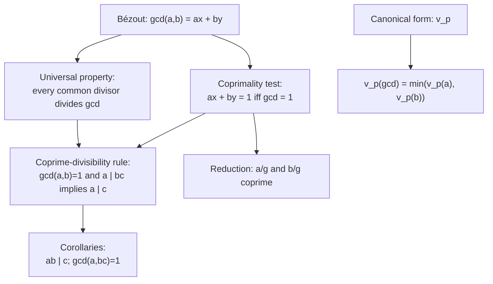

# GCD Properties and Coprimality

## The form of the gcd that proofs actually use

[The Euclidean Algorithm and the GCD](The%20Euclidean%20Algorithm%20and%20the%20GCD/) computes the gcd, and [Bézout's Identity](Be%CC%81zout%27s%20Identity/) writes it as $ax + by$. But proofs need a sharper handle than "largest common divisor": they need that every common divisor divides the gcd, and the coprime-divisibility rule that generalizes Euclid's lemma from primes to any coprime pair. This note builds both, and the properties that follow from them.

## Dependency map

## The universal characterization

Concrete first. The positive divisors of $12$ are $\{1,2,3,4,6,12\}$ and of $18$ are $\{1,2,3,6,9,18\}$. The common ones are $\{1,2,3,6\}$, so $\gcd(12,18)=6$. Every common divisor $1,2,3,6$ not only is at most $6$, it divides $6$. That is the stronger fact.


**Theorem — Universal characterization of the gcd.**

For integers $a, b$ not both zero, $d = \gcd(a,b)$ if and only if
$$\text{(i) } d \mid a \text{ and } d \mid b, \qquad \text{(ii) every common divisor } c \text{ satisfies } c \mid d. \tag{1}$$


**Proof.**

> $$\gcd(a,b) = ax + by \tag{2}$$
>
> `Definition:` condition (i) holds because the gcd is a common divisor.
>
> `Depends-on:` line $(2)$ is [Bézout's Identity](Be%CC%81zout%27s%20Identity/). For (ii), any common divisor $c$ has $c \mid a$ and $c \mid b$, so by linearity of divisibility (from 

[Divisibility](Divisibility/)) $c \mid (ax + by) = \gcd(a,b)$.

`Theorem:` uniqueness of such $d$: if $d, d'$ both satisfy (i) and (ii), then $d \mid d'$ and $d' \mid d$, and two positive integers dividing each other are equal, so $d = d'$. $\blacksquare$

`Why-this-form:` (ii) upgrades "largest" to "divisible by." Since $c \mid d$ with $d > 0$ forces $c \le d$, the universal property implies the largest-divisor definition and says more; it is the form every proof below uses.

## The coprimality test


**Definition — Coprime.**

Integers $a, b$ are coprime when $\gcd(a,b) = 1$, meaning their only common positive divisor is $1$.



**Theorem — Coprimality test.**

$\gcd(a,b) = 1$ if and only if there exist integers $x, y$ with $ax + by = 1$. $\tag{3}$


**Proof.**

> `Depends-on:` forward is [Bézout's Identity](Be%CC%81zout%27s%20Identity/) with gcd $1$. Backward: if $ax + by = 1$, any common divisor $c$ divides the left side by linearity, so $c \mid 1$, forcing $c = 1$, hence $\gcd(a,b) = 1$.

Concrete. $\gcd(35, 12) = 1$; back-substitution gives $1 = 3\cdot 12 - 35 = (-1)\cdot 35 + 3\cdot 12$. The pair $(x, y) = (-1, 3)$ is a certificate of coprimality, checkable by one multiplication: $-35 + 36 = 1$.

## The coprime-divisibility rule

This is the workhorse, and it generalizes Euclid's lemma.

Concrete first. Let $a = 4$, $b = 9$, $c = 8$, with $\gcd(4,9) = 1$. Then $4 \mid 9 \cdot 8 = 72$, and indeed $4 \mid 8$.


**Theorem — Coprime-divisibility rule.**

If $$\gcd(a,b) = 1 and a \mid bc, then a \mid c. \tag{4}$$
$$ax + by = 1 \tag{5}$$
$$acx + bcy = c \tag{6}$$


**Proof.**

> `Depends-on:` line $(5)$ is the coprimality test $(3)$.
>
> `Algebra:` line $(6)$ multiplies $(5)$ by $c$.
>
> `Property:` $a \mid acx$ (carries $a$) and $a \mid bcy$ (since $a \mid bc$), so by linearity $a$ divides the sum $c$. $\blacksquare$
>
> `Depends-on:` [Euclid's Lemma and Unique Factorization Revisited](Euclid%27s%20Lemma%20and%20Unique%20Factorization%20Revisited/) is the special case $a = p$ prime: $p \nmid b$ forces $\gcd(p, b) = 1$, so $(4)$ gives $p \mid c$. Primality was only ever used to guarantee coprimality; the real engine is coprimality. Contrast a non-coprime failure: $4 \mid 6 \cdot 2 = 12$ but $4 \nmid 6$ and $4 \nmid 2$, and here $\gcd(4,6) = 2 \neq 1$.


**Property — Two corollaries.**

(A) If $a \mid c$, $b \mid c$, and $\gcd(a,b) = 1$, then $ab \mid c$.
(B) If $\gcd(a,b) = 1$ and $\gcd(a,c) = 1$, then $\gcd(a, bc) = 1$.


**Proof.**

> `Algebra:` (A) write $c = ak = b\ell$; from $ax + by = 1$, $c = acx + bcy = a(b\ell)x + b(ak)y = ab(\ell x + ky)$, so $ab \mid c$.
>
> `Algebra:` (B) from $ax + by = 1$ and $au + cv = 1$, multiply: $(ax+by)(au+cv) = 1$; every term but $bc(yv)$ carries $a$, so $a(\cdots) + bc(yv) = 1$, giving $\gcd(a, bc) = 1$ by $(3)$.

## Scaling and reduction

Concrete first. $\gcd(12,18) = 6$; scaling by $5$ gives $\gcd(60, 90) = 30 = 5\cdot 6$; dividing by the gcd gives $\gcd(2, 3) = 1$.


**Property — Scaling.**

For $k \neq 0$, $\gcd(ka, kb) = |k|\,\gcd(a,b)$.


**Proof.**

> `Depends-on:` $|k|\gcd(a,b)$ divides $ka, kb$, and any common divisor of $ka, kb$ divides $k(ax+by) = k\gcd(a,b)$, so by the universal property $(1)$ it is $|k|\gcd(a,b)$.


**Theorem — Reduction to coprime.**

With $g = \gcd(a,b)$, the integers $a/g$ and $b/g$ are coprime.


**Proof.**

> $$g = ax + by \tag{7}$$
> $$1 = \frac{a}{g}\,x + \frac{b}{g}\,y \tag{8}$$
>
> `Depends-on:` line $(7)$ is Bézout. Line $(8)$ divides by $g$; $a/g, b/g \in \mathbb{Z}$ since $g \mid a$ and $g \mid b$. By the coprimality test $(3)$, $\gcd(a/g, b/g) = 1$. $\blacksquare$

`Type:` this is why reducing a fraction by its gcd lands in lowest terms.

## The exponent view

Concrete. $12 = 2^2 3$ and $18 = 2\, 3^2$; take each prime to the smaller exponent: $2^{\min(2,1)} 3^{\min(1,2)} = 2\cdot 3 = 6 = \gcd(12,18)$.


**Theorem — Exponent formula for the gcd.**

For every $$prime\ p, v_p(\gcd(a,b)) = \min(v_p(a), v_p(b)). \tag{9}$$


**Proof.**

> `Depends-on:` by the divisor description in [Canonical Form and 

Divisor Structure](Canonical%20Form%20and%20Divisor%20Structure/), $d$ is a common divisor exactly when $v_p(d) \le \min(v_p(a), v_p(b))$ for all $p$; the largest such $d$ takes each exponent as large as allowed, giving $(9)$. This matches the Euclidean-algorithm gcd because the gcd is unique.

`POV:` two routes to the gcd now agree — the Euclidean algorithm computes it without factoring, and $(9)$ reads it off the factorizations. Use the algorithm in practice, because factoring is the expensive step; use the exponent view in proofs.

## Summary

`For:` this gives the gcd the form proofs need (every common divisor divides it) and the coprime-divisibility rule that generalizes Euclid's lemma to any coprime pair.

`Assumes:` [Bézout's Identity](Be%CC%81zout%27s%20Identity/), spent in $(2)$, $(3)$, $(5)$, and $(7)$; the divisor description from 

[Canonical Form and Divisor Structure](Canonical%20Form%20and%20Divisor%20Structure/) for the exponent view.

`Produces:` the universal characterization $(1)$; the coprimality test $(3)$; the coprime-divisibility rule $(4)$ with Corollaries A and B; scaling and reduction; and $v_p(\gcd) = \min(v_p(a), v_p(b))$.

`Pattern-match:` whenever a hypothesis says $\gcd(a,b) = 1$, convert it to $ax + by = 1$ and multiply through — that one move proves most coprimality facts. Recognize the coprime-divisibility rule behind reducing fractions, behind Euclid's lemma as its prime special case, and behind the coming solvability of linear congruences.
