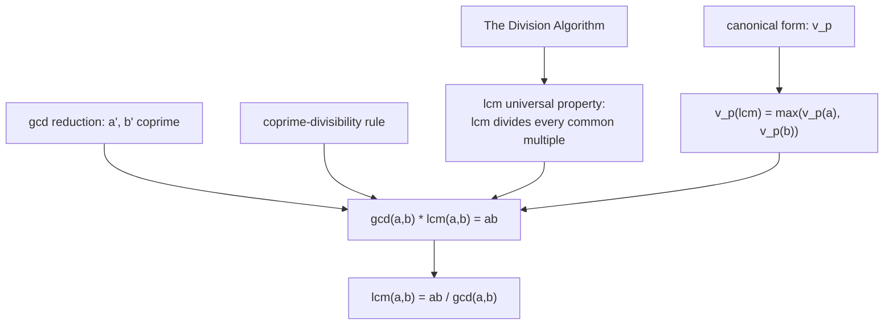

# Least Common Multiple

## The dual of the gcd, and one identity linking them

The gcd is the largest integer dividing into both $a$ and $b$. Its dual is the smallest integer both $a$ and $b$ divide into: the least common multiple. It is needed for adding fractions and aligning periodic events, and one clean identity ties it to the gcd so that each is computed from the other.

## Dependency map

## The lcm and its universal characterization

Concrete first. The positive multiples of $4$ are $4, 8, 12, 16, \dots$ and of $6$ are $6, 12, 18, 24, \dots$; the common ones are $12, 24, 36, \dots$, so $\mathrm{lcm}(4,6) = 12$. Every common multiple is itself a multiple of $12$.


**Definition — Least common multiple.**

For positive integers $a, b$, $\mathrm{lcm}(a,b)$ is the smallest positive common multiple, meaning the smallest positive integer divisible by both.



**Theorem — Universal characterization of the lcm.**

$m = \mathrm{lcm}(a,b)$ if and only if
$$\text{(i) } a \mid m \text{ and } b \mid m, \qquad \text{(ii) every common multiple } M \text{ satisfies } m \mid M. \tag{1}$$


**Proof.**

> $$M = m q + r, \qquad 0 \le r < m \tag{2}$$
> $$r = M - mq \tag{3}$$
>
> `Depends-on:` line $(2)$ is [The Division Algorithm](The%20Division%20Algorithm/). Line $(3)$ solves for $r$.
> `Property:` $a \mid M$ and $a \mid m$ give $a \mid r$ by linearity; likewise $b \mid r$. So $r$ is a common multiple with $0 \le r < m$; if $r > 0$ it is a positive common multiple below the least one $m$, impossible. So $r = 0$ and $m \mid M$. $\blacksquare$

`Why-this-form:` this is the exact dual of the gcd argument, with the division algorithm's strict bound $r < m$ forcing $r = 0$. "Smallest" is upgraded to "divides every common multiple."

## The product identity

Concrete first. $\gcd(12,18) = 6$ and $\mathrm{lcm}(12,18) = 36$, and $6 \cdot 36 = 216 = 12 \cdot 18$.


**Theorem — The gcd–lcm product.**

For positive integers $$a, b, \gcd(a,b)\cdot\mathrm{lcm}(a,b) = ab. \tag{4}$$


Two proofs, each showing a different reason.

**Proof.**

> Write $g = \gcd(a,b)$, $a = g a'$, $b = g b'$, with $\gcd(a',b') = 1$ (reduction, from [GCD Properties and Coprimality](GCD%20Properties%20and%20Coprimality/)). Claim $\mathrm{lcm}(a,b) = g a' b'$.
>
> $$a = ga' \mid ga'b', \qquad b = gb' \mid ga'b' \tag{5}$$
> $$M = ak = ga'k, \qquad b \mid M \implies b' \mid a'k \implies b' \mid k \tag{6}$$
> $$M = ga'k = ga'(b'j) = (ga'b')\,j \tag{7}$$
> $$g\cdot(ga'b') = g^2 a'b', \qquad ab = (ga')(gb') = g^2 a'b' \tag{8}$$
>
> `Algebra:` line $(5)$ shows $ga'b'$ is a common multiple: $ga'b' = ab' = ba'$.
>
> `Depends-on:` line $(6)$: from $b \mid M$, cancel $g$ to get $b' \mid a'k$; since $\gcd(a',b')=1$, the coprime-divisibility rule gives $b' \mid k$, so $k = b'j$.
>
> `Algebra:` line $(7)$ shows $ga'b' \mid M$; with $(5)$ and the universal property $(1)$, $\mathrm{lcm}(a,b) = ga'b'$.
>
> `Algebra:` line $(8)$ evaluates both sides of $(4)$ to $g^2 a'b'$, so they are equal. $\blacksquare$

## The product identity — proof via exponents


**Theorem — Exponent formula for the lcm.**

$v_p(\mathrm{lcm}(a,b)) = \max(v_p(a), v_p(b))$ for every prime $p$.


**Proof.**

> `Depends-on:` a common multiple $M$ has $v_p(M) \ge v_p(a)$ and $v_p(M) \ge v_p(b)$, so $v_p(M) \ge \max$; the smallest such $M$ takes each exponent equal to $\max$.
>
> $$\min(i,j) + \max(i,j) = i + j \tag{9}$$
> $$v_p(\gcd\cdot\mathrm{lcm}) = \min(i,j) + \max(i,j) = i + j = v_p(ab) \tag{10}$$
>
> `Algebra:` line $(9)$ holds because $\min$ and $\max$ are just the two numbers $i = v_p(a)$, $j = v_p(b)$ in the two positions, so their sum is $i + j$ either way.
>
> `Depends-on:` line $(10)$ uses that exponents add under multiplication, the gcd formula $v_p(\gcd) = \min$ from [GCD Properties and Coprimality](GCD%20Properties%20and%20Coprimality/), and the lcm formula. Since $v_p(\gcd\cdot\mathrm{lcm}) = v_p(ab)$ for all primes $p$, canonical-form uniqueness gives $\gcd\cdot\mathrm{lcm} = ab$. $\blacksquare$

Concrete check: $12 = 2^2 3$, $18 = 2\,3^2$; at $p=2$, $\min(2,1)+\max(2,1) = 1+2 = 3$; at $p=3$, $1+2 = 3$; so $\gcd\cdot\mathrm{lcm} = 2^3 3^3 = 216 = 12\cdot 18$.

## Consequences


**Equation — Working formula.**

$$\mathrm{lcm}(a,b) = \frac{ab}{\gcd(a,b)}. \tag{11}$$


`Depends-on:` rearranged from $(4)$; the lcm is computed by running the Euclidean algorithm for the gcd, then one division. Example: $\mathrm{lcm}(12,18) = 12\cdot 18/6 = 36$.


**Property — Specializations.**

If $\gcd(a,b) = 1$ then $\mathrm{lcm}(a,b) = ab$. Scaling: $\mathrm{lcm}(ka,kb) = |k|\,\mathrm{lcm}(a,b)$.


`Type:` coprime numbers share no factors to save, so their lcm is the full product; scaling shifts each exponent's $\max$ by $v_p(k)$.


**Distinction — Two numbers only.**

The identity $(4)$ is a two-number fact. For three or more, $\gcd(a,b,c)\cdot\mathrm{lcm}(a,b,c)$ is generally not $abc$, because at a single prime the middle exponent is dropped by both $\min$ and $\max$, so the three exponents do not sum correctly.


## Summary

`For:` the lcm is the smallest common multiple, dual to the gcd, and $(4)$ links the two so one is computed from the other.

`Assumes:` [The Division Algorithm](The%20Division%20Algorithm/) for the universal property; the reduction and coprime-divisibility rule from [GCD Properties and Coprimality](GCD%20Properties%20and%20Coprimality/) for the first proof; the canonical form for the second.

`Produces:` the lcm universal characterization $(1)$; the identity $\gcd\cdot\mathrm{lcm} = ab$; the exponent formula $v_p(\mathrm{lcm}) = \max$; and the working formula $(11)$.

`Pattern-match:` reach for the lcm whenever two cycles must realign (adding fractions, coincident periods), for the identity whenever a gcd is known and the lcm is wanted or the reverse, and for the $\min$/$\max$ exponent view whenever a gcd–lcm fact must be proved cleanly.
