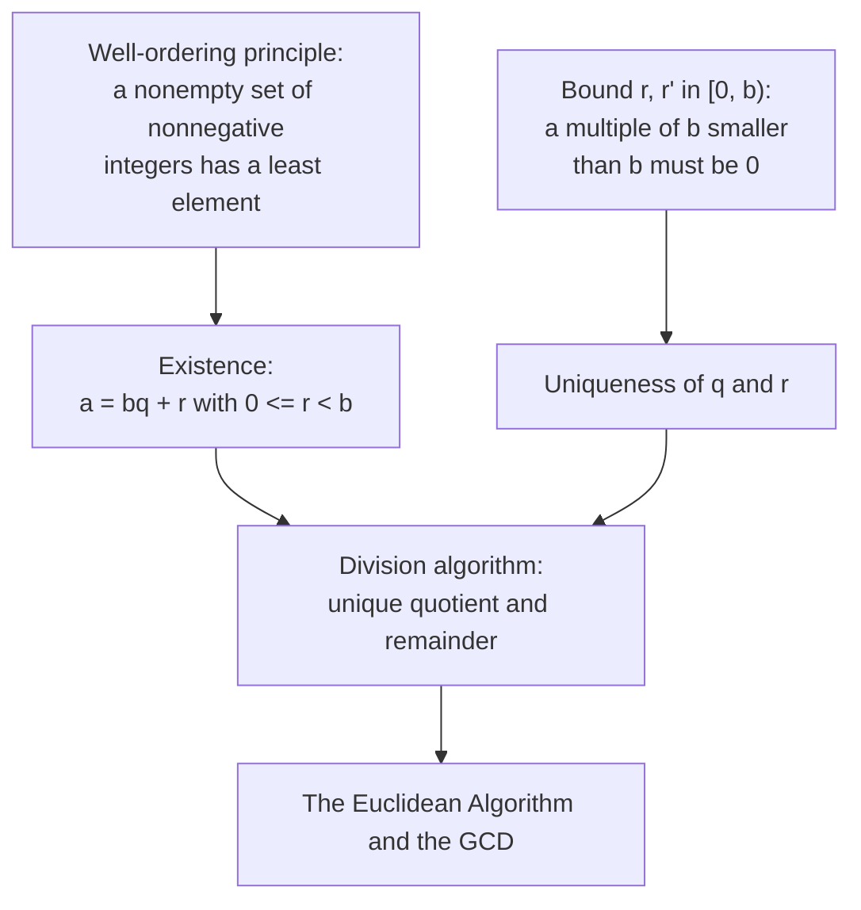

# The Division Algorithm

## A remainder that is strictly smaller than the divisor

Everything in [The Euclidean Algorithm and the GCD](The%20Euclidean%20Algorithm%20and%20the%20GCD/) rests on one atom: dividing an integer $a$ by a positive integer $b$ to leave a remainder that is guaranteed to be smaller than $b$. That strict bound is the seed of the whole method, because it is what will force the remainders to decrease and the algorithm to halt. This note establishes the atom.

## Dependency map

Existence spends well-ordering; uniqueness spends only a size observation. The atom then feeds the Euclidean algorithm.

## The statement

Concrete first. Dividing $17$ by $5$ gives $17 = 5 \cdot 3 + 2$ with remainder $2 < 5$. Dividing $17$ by $6$ gives $17 = 6 \cdot 2 + 5$ with remainder $5 < 6$. The remainder is the amount left after removing as many whole copies of the divisor as fit, and it is always smaller than the divisor.


**Theorem — Division algorithm.**

For any integer $a$ and any positive integer $b$, there exist unique integers $q$ and $r$ with
$$a = bq + r, \qquad 0 \le r < b. \tag{1}$$
$q$ is the quotient and $r$ is the remainder.


`Type:` $a \in \mathbb{Z}$, $b \in \mathbb{Z}_{>0}$, and $q, r \in \mathbb{Z}$.


**Axiom — Well-ordering principle.**

Every nonempty set of nonnegative integers has a least element, meaning a member no larger than any other.


`Why-this-form:` this is a defining property of the integers, not proved from something earlier here. It is the single engine of the existence half.

## Existence

Skeleton. Form the set of nonnegative leftovers you can reach by removing whole copies of $b$ from $a$. It is nonempty, so by well-ordering it has a least element $r$. Then $a = bq + r$ with $r \ge 0$, and $r < b$ because otherwise $r - b$ would be a smaller nonnegative leftover.

**Proof.**

> $$S = \{\, a - bq : q \in \mathbb{Z}, \ a - bq \ge 0 \,\} \tag{2}$$
> $$r = \text{least element of } S, \quad r = a - bq \text{ for the matching } q \tag{3}$$
> $$\text{if } r \ge b, \text{ then } r - b = a - b(q+1) \ge 0, \text{ so } r - b \in S \tag{4}$$
>
> `Definition:` line $(2)$ collects the nonnegative candidate remainders; $S$ is nonempty because a very negative $q$ makes $a - bq$ large and positive.
> `Depends-on:` line $(3)$ spends well-ordering on $S$; then $a = bq + r$ and $r \ge 0$ hold by membership.
> `Algebra:` line $(4)$ shows $r \ge b$ is impossible: $r - b$ would be a nonnegative leftover smaller than $r$, contradicting minimality of $r$. So $r < b$. $\blacksquare$

## Uniqueness

Skeleton. Two representations of $a$ have equal remainders, because their difference is a multiple of $b$ that is smaller in size than $b$, forcing it to be zero.

**Proof.**

> $$a = bq + r = bq' + r', \qquad 0 \le r, r' < b \tag{5}$$
> $$b(q - q') = r' - r, \qquad -b < r' - r < b \tag{6}$$
> $$r' - r = 0, \qquad q = q' \tag{7}$$
>
> `Assumption:` line $(5)$ posits two valid representations.
> `Algebra:` line $(6)$ subtracts them, so $b \mid (r' - r)$, and $r, r' \in [0, b)$ bounds the difference strictly between $-b$ and $b$.
> `Theorem:` line $(7)$ uses that the only multiple of $b$ strictly between $-b$ and $b$ is $0$, giving $r = r'$; then $b(q - q') = 0$ with $b > 0$ gives $q = q'$. $\blacksquare$

## Summary

`For:` the division algorithm produces, from any $a$ and positive $b$, a unique quotient and a remainder strictly below $b$; the strict bound is what later forces the Euclidean algorithm's remainders to decrease.

`Assumes:` the well-ordering principle, spent at line $(3)$. Uniqueness spends only the observation that a multiple of $b$ of size less than $b$ is zero.

`Produces:` existence and uniqueness of $q, r$ in $a = bq + r$, $0 \le r < b$.

`Pattern-match:` recognize the division algorithm behind modular arithmetic, where $r$ is $a \bmod b$, and behind every step of [The Euclidean Algorithm and the GCD](The%20Euclidean%20Algorithm%20and%20the%20GCD/), where each line is one application of this atom.
