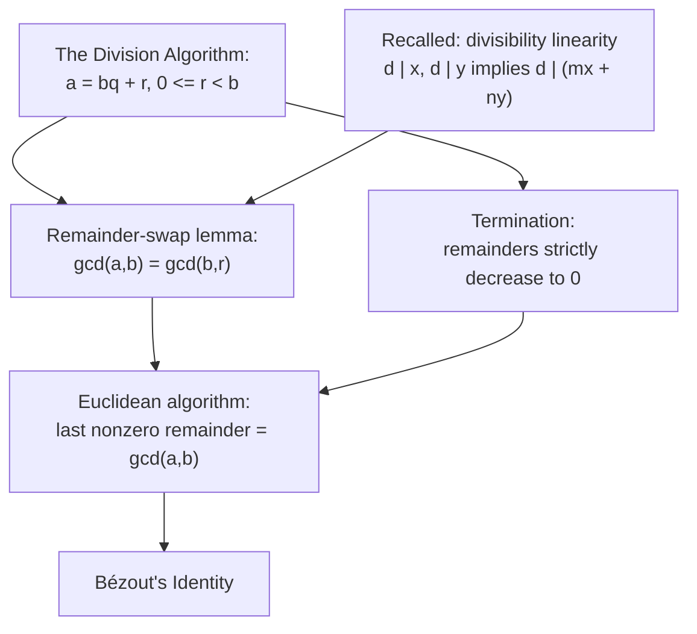

# The Euclidean Algorithm and the GCD

## Compute the gcd without factoring

Computing $\gcd(a,b)$ by factoring both numbers is expensive: trial division costs about $\sqrt{n}$ steps (see the computation section of [Canonical Form and Divisor Structure](Canonical%20Form%20and%20Divisor%20Structure/)), and no fast factoring method is known. The Euclidean algorithm computes the gcd using only repeated division, and run backward it produces the coefficients of [Bézout's Identity](Be%CC%81zout%27s%20Identity/). This note builds the gcd computation; Bézout and its consequences follow in their own notes.

## Dependency map



The algorithm rests on the remainder-swap lemma for correctness and on strictly decreasing remainders for termination.

## The objects this note spends


**Definition — Greatest common divisor.**

For integers $a, b$ not both zero, a common divisor divides both, and $\gcd(a,b)$ is the largest common divisor.


`Convention:` $\gcd(n, 0) = n$ for $n > 0$, because every integer divides $0$, so the common divisors of $n$ and $0$ are the divisors of $n$, whose largest is $n$.


**Property — Divisibility linearity.**

If $d \mid x$ and $d \mid y$ then $d \mid (mx + ny)$ for all $m, n \in \mathbb{Z}$.


**Proof.**

> `Depends-on:` [Divisibility](Divisibility/) — immediate from $x = ds$, $y = dt$, so $mx + ny = d(ms + nt)$. Same fact used in [Fundamental Theorem of Arithmetic](Fundamental%20Theorem%20of%20Arithmetic/).

## The remainder-swap lemma

Concrete first. From $252 = 2 \cdot 105 + 42$ the claim is $\gcd(252, 105) = \gcd(105, 42)$. Check one divisor: $21 \mid 252$ and $21 \mid 105$, and since $42 = 252 - 2 \cdot 105$, also $21 \mid 42$. Every common divisor transfers the same way, so the two pairs share a gcd.


**Theorem — Remainder-swap lemma.**

If $$ a = bq + r, then\ gcd(a,b) = gcd(b,r). \tag{1}$$


Skeleton. Show the two pairs have the identical set of common divisors; equal sets of divisors have the same largest element.

**Proof.**

> $$d \mid a, \ d \mid b \implies d \mid (a - bq) = r \tag{2}$$
> $$d \mid b, \ d \mid r \implies d \mid (bq + r) = a \tag{3}$$
>
> `Property:` line $(2)$ applies linearity with $r = a - bq$: every common divisor of $(a,b)$ divides $r$, hence is a common divisor of $(b, r)$.
> `Property:` line $(3)$ applies linearity with $a = bq + r$: every common divisor of $(b, r)$ divides $a$, hence is a common divisor of $(a, b)$.
> `Theorem:` the two sets of common divisors are equal, so their greatest elements agree, giving $\gcd(a,b) = \gcd(b,r)$. $\blacksquare$
>
> `Type:` the remainder $r$ carries exactly the same common divisors as $a$, so the gcd survives the swap to the smaller pair $(b, r)$.

## The algorithm

Concrete first, $\gcd(252, 105)$. Divide, then feed divisor and remainder back:
$$252 = 2 \cdot 105 + 42, \quad 105 = 2 \cdot 42 + 21, \quad 42 = 2 \cdot 21 + 0.$$
The last nonzero remainder is $21$, and $\gcd(252, 105) = 21$ (check: $252 = 21 \cdot 12$, $105 = 21 \cdot 5$).


**Theorem — The last nonzero remainder is the gcd.**

Starting from $a > b > 0$ and dividing repeatedly, the last nonzero remainder equals $\gcd(a,b)$.


## The algorithm — justification

$$a = b q_1 + r_1, \quad b = r_1 q_2 + r_2, \quad r_1 = r_2 q_3 + r_3, \ \dots \tag{4}$$
$$\gcd(a,b) = \gcd(b, r_1) = \gcd(r_1, r_2) = \cdots = \gcd(r_k, 0) = r_k \tag{5}$$

`Depends-on:` line $(4)$ applies [The Division Algorithm](The%20Division%20Algorithm/) repeatedly; each line's divisor and remainder become the next line's dividend and divisor.

`Theorem:` line $(5)$ chains the remainder-swap lemma $(1)$ down each line, then uses $\gcd(r_k, 0) = r_k$; so the last nonzero remainder $r_k$ is the gcd. $\blacksquare$

## Termination

$$b > r_1 > r_2 > r_3 > \cdots \ge 0 \tag{6}$$

`Depends-on:` line $(6)$ is the strict bound $0 \le r < b$ from [The Division Algorithm](The%20Division%20Algorithm/), applied at each step, so each remainder is strictly below the previous one.

`Axiom:` a strictly decreasing sequence of nonnegative integers cannot continue forever, by well-ordering; so some remainder reaches $0$ and the algorithm halts, with $r_k$ the step before that zero. $\blacksquare$

## Computation

Mechanism by hand: repeated division as in $(4)$, reading the last nonzero remainder. The recursive form uses the remainder-swap lemma directly.

```python
def gcd(a: int, b: int) -> int:
    """Return gcd(a, b) by the Euclidean algorithm (no factoring).

    Each step replaces (a, b) by (b, a mod b); the remainder-swap lemma
    guarantees the gcd is unchanged, and the strict decrease of remainders
    guarantees termination. Returns the last nonzero remainder, reached
    when b becomes 0.
    """
    while b != 0:
        a, b = b, a % b          # one application of the division algorithm
    return a
```

`Conditioning:` the number of steps is bounded by roughly the number of digits of the smaller input, far below the $\sqrt{n}$ cost of factoring. The worst case is consecutive Fibonacci numbers, where every quotient is $1$.

## Summary

`For:` the algorithm computes $\gcd(a,b)$ using only repeated division, meeting the need to avoid factoring, and it produces the equation chain that [Bézout's Identity](Be%CC%81zout%27s%20Identity/) runs backward.

`Assumes:` [The Division Algorithm](The%20Division%20Algorithm/) for the remainders and its strict bound for termination; divisibility linearity for the remainder-swap lemma. Well-ordering underlies both, once through the division algorithm and once through the strictly decreasing remainders.

`Produces:` the remainder-swap lemma $\gcd(a,b) = \gcd(b,r)$, the result that the last nonzero remainder is the gcd, and a guarantee of termination.

`Pattern-match:` recognize the same descent template as in [Fundamental Theorem of Arithmetic](Fundamental%20Theorem%20of%20Arithmetic/): subtract multiples to force a strictly smaller object while preserving an invariant, here the set of common divisors rather than the factorization.
