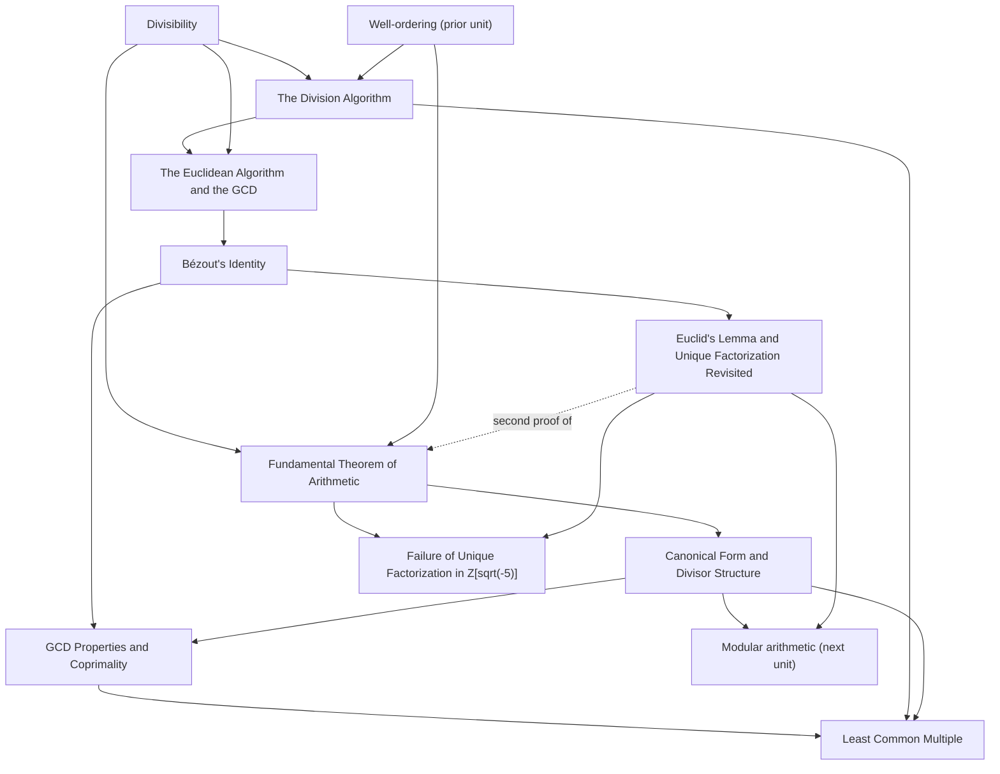

+++
title = "Unique Factorization"
+++

# Unique Factorization

The unit that establishes prime factorization is unique and builds the machinery around it: divisibility and the division algorithm as the foundation, the Fundamental Theorem of Arithmetic, the canonical form and divisor structure it produces, and the Euclidean algorithm that computes the gcd, yields Bézout's identity, and supplies Euclid's lemma to re-prove uniqueness by the standard route. It closes with the gcd properties, the least common multiple, and a proof that uniqueness fails outside Z. Scope: from divisibility through the failure in Z[sqrt(-5)]. It follows the natural-numbers unit and precedes modular arithmetic.

## Topic notes in reading order

#### [Divisibility](Divisibility/) 

The relation $a \mid b$ (there is $k$ with $b = ak$), its edge cases, reflexivity/transitivity/antisymmetry, the divisor size bound, and linearity, the workhorse of the unit.

#### [The Division Algorithm](The%20Division%20Algorithm/) 

The atom: dividing $a$ by positive $b$ gives a unique quotient and a remainder strictly below $b$.

#### [Fundamental Theorem of Arithmetic](Fundamental%20Theorem%20of%20Arithmetic/) 

Every integer above $1$ is a product of primes (existence), and that product is forced up to order (uniqueness by the Lindemann–Zermelo route, avoiding Euclid's lemma on purpose).

#### [Canonical Form and Divisor Structure](Canonical%20Form%20and%20Divisor%20Structure/) 

The single pinned form $n = p_1^{a_1} \cdots p_k^{a_k}$, the exponent function $v_p(n)$, which integers divide $n$, and the divisor count $\tau(n) = \prod (a_i + 1)$.

#### [The Euclidean Algorithm and the GCD](The%20Euclidean%20Algorithm%20and%20the%20GCD/) 

The remainder-swap lemma $\gcd(a,b) = \gcd(b,r)$, the algorithm whose last nonzero remainder is the gcd, and its termination.
#### [Bézout's Identity](Be%CC%81zout%27s%20Identity/) 

Writing $\gcd(a,b) = ax + by$ by back-substitution, and the fact that the values of $ax + by$ are exactly the multiples of the gcd.
#### [GCD Properties and Coprimality](GCD%20Properties%20and%20Coprimality/) 

The universal characterization (every common divisor divides the gcd), the coprimality test $ax + by = 1 \iff \gcd = 1$, the coprime-divisibility rule that generalizes Euclid's lemma, scaling and reduction, and $v_p(\gcd) = \min$.

#### [Euclid's Lemma and Unique Factorization Revisited](Euclid%27s%20Lemma%20and%20Unique%20Factorization%20Revisited/)

A prime dividing a product divides a factor, and the short second proof of FTA uniqueness that discharges the deferred debt.

#### [Least Common Multiple](Least%20Common%20Multiple/) 

The smallest common multiple, its universal property, and the identity $\gcd(a,b)\cdot\mathrm{lcm}(a,b) = ab$ proved two ways.
#### [Failure of Unique Factorization in Z(sqrt-5)](Failure%20of%20Unique%20Factorization%20in%20Z%28sqrt-5%29/) 

A ring where $6$ has two genuinely different irreducible factorizations, diagnosed as irreducible-not-prime for want of a division algorithm.

## Dependency map

